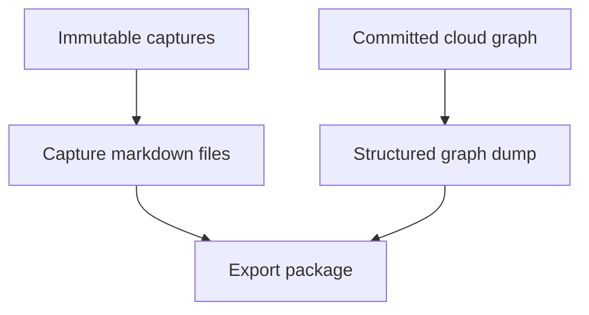

# Graph ownership export

## Summary

Acta stays a cloud-hosted graph. The v1 ownership proof is a settings export: raw captures as markdown, plus a structured graph dump a future import could restore from. Local-first markdown as the live database is parked.

---

## Problem Frame

A filled personal evidence graph is more sensitive than one resume. Friends bouncing the idea asked whether Acta should store a life in a database, and whether that data is the user's first, the way an Obsidian vault is.

Those comments did not come from the internship ICP. Students already paste resumes and cover letters into ChatGPT. Their revealed preference is a better artifact, not a local vault. Replacing Postgres with a folder of notes would also fight Acta's model: typed endeavors, edges, pending proposals, and confirm-before-write. Markdown can project a graph. It is a poor live database for one.

The remaining product need is ownership you can point at: if I leave, I take my words and my graph with me. That is not the same as "Acta never had a copy." Extract still sends capture text to a model. End-to-end encryption would block server-side AI. This brief accepts that gap.

---

## Key Decisions

- **Cloud graph remains source of truth.** Web app plus Postgres stays the data home. Desktop is still optional later, not a storage rewrite.
- **Local-first markdown-as-database is parked.** Obsidian-parity local files are a different product, as already listed in `docs/surfaces-and-flows.md`. This brief does not reopen that.
- **The claim is "you can leave," not "we never saw it."** Privacy messaging stays honest: encrypted in transit and at rest, never train, never sell, export anytime. AI reads the graph by design. Friends who wanted no cloud copy will still object.
- **Export shape is captures-as-markdown plus a structured graph dump.** Captures are already prose; they should open in any text editor. The graph is structured; it ships as a dump (working name `graph.json`) so it is restore-able later. One markdown note per endeavor is out, because it invites a second source of truth and a fake round-trip.
- **Graph dump is canonical portable graph, not runtime.** Include entities, edges, stamps, tags, and capture links. Exclude pending proposals (not committed), embeddings, and canvas physics.
- **Ownership export is free.** Gating "take your life with you" would contradict the trust story. Resume-format exports (PDF, Jake's, DOCX) can still be a later premium axis.
- **Ship after the capture loop.** Document now. Build with persistence extras (building-plan **U-E**), not ahead of capture, extract, and diff-skim.
- **Download only in v1.** Restore-from-export is later. Edited markdown is not imported.

---

## Requirements

**Platform**

- R1. The live graph remains in the cloud app. Local files are an export projection, not the database the product runs on.
- R2. Extract, proposals, and merge keep their current write policy. Export does not change when agents may write the graph.

**Export contents**

- R3. A signed-in user can download their full corpus from settings in one package.
- R4. Every Capture is a markdown file whose body is the original capture text, readable without Acta.
- R5. The package includes one structured graph dump covering committed entities, edges, stamps, application tags, and capture links.
- R6. Pending proposals are omitted from the graph dump. Captures that produced them are still exported.
- R7. The dump is complete enough that a future import could reconstruct the committed graph without Acta-only runtime (embeddings, canvas positions, open proposal UI state).

**Trust and access**

- R8. Export is available on the free seat. It is not a premium hostage.
- R9. Export does not mutate graph or capture data.
- R10. Product copy for this feature says the user can leave with their data. It does not claim Acta or model providers never held plaintext.

---

## Key Flows

- F1. Leave with your corpus
  - **Trigger:** Signed-in user chooses export in settings.
  - **Steps:** Acta packages all of that user's captures as markdown and one structured graph dump. The user downloads the package. Nothing in Acta changes.
  - **Outcome:** The user has files they can read, archive, and grep without the app.
  - **Covered by:** R3, R4, R5, R9

---

## Acceptance Examples

- AE1. Readable captures
  - **Covers R4.**
  - **Given:** A user has typed three captures.
  - **When:** They export.
  - **Then:** The package contains three markdown files. Opening any of them in a plain text editor shows that capture's original text.

- AE2. Committed graph, not pendings
  - **Covers R5, R6.**
  - **Given:** A user has two confirmed endeavors and one open extract proposal with a pending ghost.
  - **When:** They export.
  - **Then:** The graph dump includes the two endeavors and their edges. It does not include the pending proposal as committed graph. The source capture of that proposal is still in the markdown files.

- AE3. Empty graph still exports captures
  - **Covers R3, R4, R5.**
  - **Given:** A user has captures but has discarded every extract proposal, so no endeavors exist.
  - **When:** They export.
  - **Then:** Markdown captures are present. The graph dump is valid and empty of endeavors.

- AE4. Export is not a write
  - **Covers R9.**
  - **Given:** A user is mid diff-skim with pending nodes on the canvas.
  - **When:** They export from settings.
  - **Then:** Pendings, captures, and confirmed nodes are unchanged.

---

## Success Criteria

- A user can leave Acta and still read every capture they typed, in ordinary markdown.
- A future import, not built in v1, has a complete committed-graph dump to restore from. Planning should not need to invent a second export format for that.
- Ownership copy stays consistent with privacy copy: leave-with-it, not no-cloud-copy.

---

## Scope Boundaries

### Deferred for later

- Restore / import from the graph dump
- Round-trip from edited capture markdown
- Live folder sync, git vault, or desktop file watcher
- On-device extract or end-to-end encryption
- Resume-format exports (in-app PDF, Jake's LaTeX, DOCX)
- One markdown note per endeavor as a pretty projection (only after the dump exists, and only if marked derived)

### Outside this product's identity

- Obsidian-parity local files as source of truth
- A PKM / second-brain product for people who will not put a life graph on a server
- Replacing the typed graph with a folder of notes

---

## Dependencies / Assumptions

- Capture, extract, and committed graph writes exist before this ships (building-plan **U-E** extras; tech plan export stub).
- Canonical docs still say cloud data home and not-E2E-for-MVP. This brief refines export. It does not reverse those.
- Settings already owns export as a surface (`docs/surfaces-and-flows.md`). This brief specifies what that export contains.
- Model providers still see capture text whenever extract runs. File export does not close that.

---

## Outstanding Questions

### Deferred to Planning

- Exact package layout (filenames, whether the dump is JSON, whether a short README belongs in the download).
- Whether kind-specific `ext` fields and evidence blob bytes ship in v1 or as stubs plus URLs.
- How capture markdown encodes provenance (`source_type`, timestamps) without making the body unreadable.
- When canonical product docs (`docs/personal-evidence-graph.md`, `docs/surfaces-and-flows.md`) get the one-line export-shape update: with this brief, or when **U-E** ships.

---

## Sources

- `docs/personal-evidence-graph.md`: cloud data home, privacy (not E2E because AI reads the graph), export desirable, artifacts are views over the graph.
- `docs/surfaces-and-flows.md`: settings/export surface; Obsidian-parity local files called a different product.
- `docs/data-model.md`: captures are immutable intake; graph is source of truth.
- `docs/agent-interaction-model.md`: proposals are not committed until confirm.
- `docs/building-plan.md` **U-E**: export queued with persistence extras.
- Adjacent market: Obsidian vs Notion ownership is a real PKM split. Internship users already paste career text into ChatGPT. Local-first resume builders that add AI still send text to a provider.
