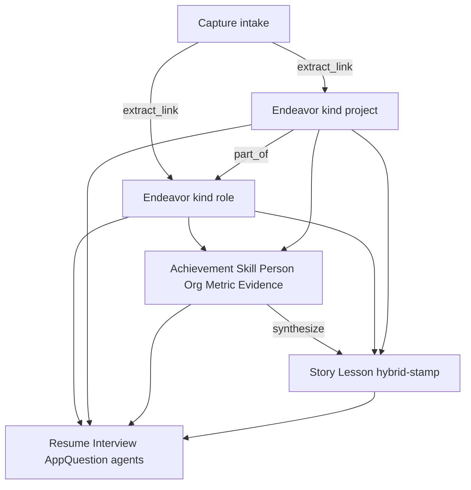

# Acta — Data Model Spec

Last updated: 2026-07-26

Product: **Acta** — personal evidence graph. Companion to [`personal-evidence-graph.md`](personal-evidence-graph.md) (product spec) and [`surfaces-and-flows.md`](surfaces-and-flows.md) (Graph UI). **This doc owns schema, entity types, edges, provenance, extraction contracts, and how adapters/agents consume the graph.** Product decisions that depend on the model should link here rather than inventing schema in the product doc.

Status: **v1 draft locked for implementation planning** (not code yet). Guideline-first: structured and detailed, soft on user overrides.

---

## Relationship to product spec

| Doc | Owns |
| --- | --- |
| `personal-evidence-graph.md` | Vision, wedge, adapters, monetization, relevance *behavior*, open product questions |
| `surfaces-and-flows.md` | Graph UI / surfaces / flows |
| `agent-interaction-model.md` | Agent write policy, confirm vs auto, pending proposals |
| `data-model.md` (this) | What exists in the graph, how captures become entities, IDs, edges, versioning, provenance, agent/adapter read shapes |

When product and model conflict, resolve explicitly and update both.

---

## Principles

1. **Graph is source of truth.** Adapters (resume, interview, app question) query **entities + edges**, not raw journals as the primary path.
2. **Captures are intake + provenance**, not a competing database of truth.
3. **Guideline-first, not hard-gated.** Kind profiles drive suggestions (UI chips, deepen prompts, extract priors). Users may attach atypical evidence or fill unusual fields; the product should not *suggest* nonsense, but must **allow** it.
4. **One `kind` per Endeavor.** “Both a job and a project” = nesting (`project` `part_of` `role`), not multi-kind on one node.
5. **Optional density.** Children are **0..n** — an Endeavor is valid with zero Achievements, Skills, Metrics, etc.
6. **Primary vs secondary.** Facts live on Endeavors + children. **Stories** and **Lessons** are agent-synthesized, stored, regenerable, and **hybrid-stamped** (user edit wins).
7. **Same spine for career and creative.** Kind changes theme + suggestions, not a second graph.
8. **Views are projections** over one stored edge set (by containment, kind, skill, people, tags) — not alternate schemas. **Canvas rendering** (which entity types are drawn as physics nodes) is owned by [`surfaces-and-flows.md`](surfaces-and-flows.md): v1 draws **Endeavors only**; Skills, People, and Orgs remain stored entities but are not canvas nodes (org context lives on role/education endeavors via `at_org`).

### What is hard vs soft

| Hard (schema) | Soft (guidelines / priors) |
| --- | --- |
| Entity types + typed fields | Which fields UI surfaces first per kind |
| Shared Endeavor base | Which evidence types are *suggested* per kind |
| Typed edges with known endpoints | Extract LLM “look for org/title on roles…” |
| Story/Lesson stamp lifecycle | Primary-parent hint for resume nesting |
| Capture immutability as intake | Unusual-but-allowed attachments |

---

## Mental model

```
Capture (typed yap, import chunk, later: voice, etc.)
        ↓
Extract + link
        ↓
Endeavor DAG (kind) + primary children     ← adapters query this
        ↓
Story / Lesson (synthesize, store, stamp)
        ↑
Source capture kept for provenance / re-extract
```



**Layers**

1. **Intake** — `Capture`
2. **Primary** — `Endeavor` DAG + fact children
3. **Secondary** — `Story` / `Lesson` (hybrid stamp)
4. **Surfacing** — application tags + kind suggestion profiles + graph view projections + NL explore

---

## Shared conventions

### IDs & ownership

- Every entity has `id` (stable string UUID).
- v1 graph is **single-tenant per user** (`user_id` on all roots). Multi-user / coach-share out of scope.
- Timestamps: `created_at`, `updated_at` (ISO-8601).

### Lifecycle status

On Endeavor and most primary entities:

| `status` | Meaning |
| --- | --- |
| `active` | Normal; eligible for adapters |
| `demoted` | Soft archive — gray out, lower relevance, can resurface |
| `archived` | Stronger hide; still recoverable |
| Hard delete | Rare / opt-in (didn’t happen / don’t want association) — not auto-purge |

### Timeframe

Fuzzy OK — do not require exact day ranges.

```
timeframe: {
  start?: { year: number, month?: number, day?: number },
  end?:   { year: number, month?: number, day?: number } | "ongoing",
  label?: string   // e.g. "Summer 2025", "2024"
}
```

### Application tags

**What they are:** labels for which **product surfaces** a node is generally useful for — not what the endeavor *is* (`kind`) and not JD-specific matching. At intake, an LLM suggests tags; the user can edit. At generate time, tags **narrow the candidate set**; a separate ranker matches the specific JD/question (see product spec: hybrid relevance).

Multi-tag per entity; **user override wins** over LLM.

| Field | Type | Notes |
| --- | --- | --- |
| `tag` | enum | Allowed values below |
| `source` | `llm` \| `user` | |
| `confidence?` | 0..1 | LLM only |
| `overridden` | bool | true if user edited |

**Allowed tags (v1):**

| Tag | Meaning |
| --- | --- |
| `internship_resume` | Good for internship resume views |
| `interview_story` | Good for interview / STAR-style surfaces |
| `app_question` | Good for written application answers |
| `linkedin` | Good for LinkedIn-style posts/profile |
| `personal_site` | Good for personal site |
| `portfolio` | Good for portfolio / project showcase |
| `keep_personal` | Keep in graph; exclude from recruiting surfaces by default |

### Citation target

Adapters cite:

```
{ entity_id: string, evidence_id?: string, capture_id?: string, span?: { start: number, end: number } }
```

---

## Entity catalog

### Capture (intake)

Immutable raw intake. Re-extract links to new/updated entities; do not rewrite capture text after create.

| Field | Required | Type | Notes |
| --- | --- | --- | --- |
| `id` | yes | string | |
| `user_id` | yes | string | |
| `text` | yes | string | Full text retained |
| `source_type` | yes | enum | `typed` \| `resume_import` \| `linkedin_import` \| `github_import` \| `other_import` (voice later) |
| `source_meta?` | no | object | filename, URL, repo, import batch id |
| `captured_at` | yes | datetime | When the life note/event is *about* (user-facing time; may be backdated) |
| `created_at` | yes | datetime | When this Capture row was written in Acta |

Often equal for a live typed yap; can differ for imports or “note about last week.”

**Retention:** always keep full text for provenance and re-extract. Chunking is an implementation detail for embedding/index — not a second SoT.

---

### Endeavor (primary container)

One polymorphic type. **`kind` selects suggestion profile + UI theme**, not a closed field prison.

#### Shared base (always)

| Field | Required | Type | Notes |
| --- | --- | --- | --- |
| `id` | yes | string | |
| `user_id` | yes | string | |
| `kind` | yes | enum | See kinds below — **exactly one** |
| `title` | yes | string | |
| `summary?` | no | string | Short plain-language blurb |
| `timeframe?` | no | Timeframe | Fuzzy OK |
| `status` | yes | enum | `active` \| `demoted` \| `archived` |
| `application_tags` | yes | Tag[] | May be empty |
| `primary_parent_id?` | no | string | Soft display default when multiple parents; guideline only |
| `ext?` | no | object | Kind-specific custom fields (see profiles). Custom properties per kind are expected. **Promote into shared base or a named profile field only if the same key is used meaningfully across 3+ kinds** |
| `created_at` / `updated_at` | yes | datetime | |

#### Kinds (v1)

| Kind | Meaning | UI theme cue |
| --- | --- | --- |
| `role` | Career / employment-shaped position (job, internship, lab RA as work affiliation) | Professional / career |
| `leadership` | Club, org, or community leadership affiliation (officer, captain, organizer) — not a career job | Leadership / org |
| `project` | Bounded body of work (product, research, OSS, hackathon build, course project) | Build / shipping |
| `creative_work` | Artistic or media body of work (series, EP, show, publication) | Creative |
| `course` | Single class / academic course container | Academic course |
| `education` | Degree or program container (e.g. BS CS at State U) — distinct from a single course | Education / degree |
| `event` | Time-bounded program or gathering not itself a job/project (YC Startup School, hackathon weekend, conference, competition) | Event |
| `volunteer` | Service stint / nonprofit affiliation | Service |
| `hobby` | Ongoing personal interest or craft (climbing, chess, casual music) | Hobby |

**`role` vs `leadership`:** internship at Stripe → `role`. President of Hack Club → `leadership`. Leadership can still nest projects/events; it is not forced into career `role`.

**`course` vs `education`:** CS229 → `course`. “BS Computer Science, 2023–2027” → `education`. Courses often `part_of` an `education` node.

**`event`:** Standalone when there is no parent job/project (e.g. YC Startup School). Hackathon *projects* typically `part_of` the hackathon `event`.

#### Kind suggestion profiles

Profiles are **Suggested / Common / Unusual (allowed)**. Unusual remains valid graph data. Kind-specific fields may live in `ext`.

**`role`**

| Tier | Fields / evidence |
| --- | --- |
| Suggested fields | `title_at_org`, link `at_org`, `employment_type?` (`internship` \| `ft` \| `pt` \| `contract` \| `unpaid` \| `other`) |
| Common | Achievements, Skills, People, Metrics (when quantified), child `project`s via `part_of` |
| Suggested evidence | `commit`, `pr`, `doc`, `url`, `image` |
| Unusual (allowed) | `audio`, `video`, portfolio files |

**`leadership`**

| Tier | Fields / evidence |
| --- | --- |
| Suggested fields | `title_in_org?` (e.g. President), link `at_org` (club/org) |
| Common | Achievements, People, Skills (`soft` / `domain`); child `project`s or `event`s |
| Suggested evidence | `doc`, `url`, `image` |
| Unusual (allowed) | `commit`, `pr`, media |

**`project`**

| Tier | Fields / evidence |
| --- | --- |
| Suggested fields | `repo_url?`, `demo_url?`, `stack_notes?` |
| Common | Achievements, Skills, Metrics, People; often `part_of` a `role`, `course`, `event`, or `education` |
| Suggested evidence | `commit`, `pr`, `doc`, `url`, `image` |
| Unusual (allowed) | `audio`, `video` |

**`creative_work`**

| Tier | Fields / evidence |
| --- | --- |
| Suggested fields | `medium?` (music, visual, writing, film, …), `venue_or_show?`, `release_url?` |
| Common | Achievements, Skills (`craft`), People; child works via `part_of` |
| Suggested evidence | `audio`, `video`, `image`, `url`, `portfolio_file`, `doc` |
| Unusual (allowed) | `commit`, `pr` |

**`course`**

| Tier | Fields / evidence |
| --- | --- |
| Suggested fields | `course_code?`, link `at_org` (school); often `part_of` an `education` |
| Common | Child `project`s, Skills, People (professor, teammates) |
| Suggested evidence | `doc`, `url`, `image` |
| Unusual (allowed) | `commit`, `pr`, media |

**`education`**

| Tier | Fields / evidence |
| --- | --- |
| Suggested fields | `degree?`, `major?`, `minor?`, link `at_org` (school), grad/expected year in timeframe |
| Common | Child `course`s and `project`s; Skills; People |
| Suggested evidence | `doc`, `url`, `image` |
| Unusual (allowed) | media, commits |

**`event`**

| Tier | Fields / evidence |
| --- | --- |
| Suggested fields | `event_type?` (`hackathon` \| `program` \| `conference` \| `competition` \| `workshop` \| `other`), `location_or_url?`, link `at_org?` (host) |
| Common | Child `project`s (hackathon builds); Achievements; People; Skills |
| Suggested evidence | `url`, `image`, `doc`, `portfolio_file` |
| Unusual (allowed) | `commit`, `pr`, `audio`, `video` |

**`volunteer`**

| Tier | Fields / evidence |
| --- | --- |
| Suggested fields | link `at_org`, `cause?` |
| Common | Achievements, People; Metrics optional |
| Suggested evidence | `doc`, `url`, `image` |
| Unusual (allowed) | media, commits |

**`hobby`**

| Tier | Fields / evidence |
| --- | --- |
| Suggested fields | `medium?`, `frequency?` |
| Common | Sparse Achievements; Skills; People |
| Suggested evidence | By medium (music → `audio`; climbing → `image`/`url`) |
| Unusual (allowed) | anything user attaches |

#### Nesting (Endeavor ↔ Endeavor)

Endeavors form a **DAG** via stored **`part_of`** edges (child → parent). **`contains` is not stored** — it is the derived inverse for queries/UI. **Multiple parents allowed.**

| Pattern | Example |
| --- | --- |
| Single parent (common) | Redis `project` `part_of` Bubble intern `role` |
| Event standalone | YC Startup School as `event` with no required parent |
| Event + project | Hackathon app `project` `part_of` hackathon `event` |
| Education tree | `course` / `project` `part_of` `education` |
| Leadership | Club `project` or `event` `part_of` `leadership` officer node |
| Multi-parent | OSS contrib `part_of` job `role` **and** upstream OSS `project` |
| Multi-parent | Research `project` under lab `role` **and** thesis `course` |
| Creative | Track `creative_work` `part_of` album and/or studio `role` |

**Guidelines — when not to multi-parent**

- Do **not** invent parent Endeavors for skills (“Backend”). Use **Skill** nodes + `used_skill`. Real club leadership → `leadership` kind, not a fake folder.
- Do not duplicate the same endeavor; one node, many parents.
- Loose “inspired by / similar” → `related_to`, not containment.

**Primary parent:** optional `primary_parent_id` (or `is_primary` on a `part_of` edge) for resume-style nesting when multiple parents exist. Soft; adapters may also pick the parent matching the artifact.

---

### Achievement

Atomic claim / contribution under one or more Endeavors (“built Redis cache”, “premiered piece at X”). Resume-bullet shaped, but not resume-only.

| Field | Required | Type | Notes |
| --- | --- | --- | --- |
| `id` | yes | string | |
| `user_id` | yes | string | |
| `statement` | yes | string | The claim in plain language |
| `detail?` | no | string | Tradeoffs, context |
| `timeframe?` | no | Timeframe | |
| `status` | yes | enum | |
| `application_tags` | yes | Tag[] | |
| `created_at` / `updated_at` | yes | datetime | |

**Cardinality:** 0..n per Endeavor via `part_of` / `achieved_in` edges. An Achievement should usually link to ≥1 Endeavor (guideline); orphan achievements allowed temporarily during extract.

---

### Skill

Shared vocabulary entity (still stored and linked). **Not** a Graph-home canvas node in v1 — skill-centric UX is filter / modal / Explore→endeavors (see [`surfaces-and-flows.md`](surfaces-and-flows.md)); ratio of skills to endeavors would muddle force-directed layout.

| Field | Required | Type | Notes |
| --- | --- | --- | --- |
| `id` | yes | string | |
| `user_id` | yes | string | |
| `name` | yes | string | Canonical display (“Redis”, “Oil painting”, “Ownership”) |
| `skill_kind` | yes | enum | `tech` \| `craft` \| `soft` \| `domain` |
| `aliases?` | no | string[] | Dedup helpers (“JS”, “JavaScript”) |
| `status` | yes | enum | |
| `created_at` / `updated_at` | yes | datetime | |

Link to Endeavors and/or Achievements via `used_skill` (0..n either side).

**Dedup / aliases:** LLM may propose merges and alias adds; **user confirms** — no silent auto-merge of distinct skills.

---

### Person

Collaborator, mentor, manager, teammate, professor, etc. **Not** a Graph-home canvas node in v1 — lives on endeavor modals / edges (see [`surfaces-and-flows.md`](surfaces-and-flows.md)).

| Field | Required | Type | Notes |
| --- | --- | --- | --- |
| `id` | yes | string | |
| `user_id` | yes | string | |
| `name` | yes | string | |
| `notes?` | no | string | |
| `status` | yes | enum | |
| `created_at` / `updated_at` | yes | datetime | |

Role relative to an Endeavor lives on the **edge** (`involved_person.role`: `teammate` \| `manager` \| `mentor` \| `collaborator` \| `professor` \| `other`).

---

### Org

Company, school, club, lab, gallery, nonprofit, label. **Not** a Graph-home canvas node — redundant with endeavor nodes that already represent roles/education *at* an org (`at_org`); Org stays a stored entity for linking/dedup (see [`surfaces-and-flows.md`](surfaces-and-flows.md)).

| Field | Required | Type | Notes |
| --- | --- | --- | --- |
| `id` | yes | string | |
| `user_id` | yes | string | |
| `name` | yes | string | |
| `org_kind?` | no | enum | `company` \| `school` \| `club` \| `lab` \| `nonprofit` \| `gallery` \| `label` \| `other` |
| `url?` | no | string | |
| `status` | yes | enum | |
| `created_at` / `updated_at` | yes | datetime | |

---

### Metric

First-class quantified claim. **Never required** on any Endeavor.

| Field | Required | Type | Notes |
| --- | --- | --- | --- |
| `id` | yes | string | |
| `user_id` | yes | string | |
| `label` | yes | string | “p95 latency”, “streams” |
| `value` | yes | number \| string | Prefer number; string for “~60%” if needed |
| `unit?` | no | string | `%`, `ms`, `users`, … |
| `direction?` | no | enum | `up` \| `down` \| `neutral` |
| `context?` | no | string | Baseline / window |
| `status` | yes | enum | |
| `created_at` / `updated_at` | yes | datetime | |

Link via `reports_metric` to Achievement and/or Endeavor.

---

### Evidence

Attachable provenance object (not the same as Capture text).

| Field | Required | Type | Notes |
| --- | --- | --- | --- |
| `id` | yes | string | |
| `user_id` | yes | string | |
| `evidence_kind` | yes | enum | `commit` \| `pr` \| `doc` \| `url` \| `image` \| `audio` \| `video` \| `portfolio_file` \| `other` |
| `title?` | no | string | |
| `uri?` | no | string | URL or storage path |
| `meta?` | no | object | sha, PR number, mime, duration, … |
| `status` | yes | enum | |
| `created_at` / `updated_at` | yes | datetime | |

Attach via `supported_by` to Endeavor, Achievement, Story, or Lesson. **Suggested by Endeavor kind** (see profiles); **any kind may attach any evidence** if the user chooses.

---

### Story (secondary)

Narrative unit for interviews, app questions, and other story-shaped asks. Agent-synthesized from primary subgraph; stored; regenerable; **hybrid-stamped**.

| Field | Required | Type | Notes |
| --- | --- | --- | --- |
| `id` | yes | string | |
| `user_id` | yes | string | |
| `title` | yes | string | |
| `situation?` | no | string | STAR-ish; fields optional individually |
| `task?` | no | string | |
| `action?` | no | string | |
| `result?` | no | string | |
| `body?` | no | string | Freeform narrative if STAR split unused |
| `synthesis_status` | yes | enum | `draft` \| `stamped` \| `stale` |
| `sourced_from_entity_ids` | yes | string[] | Primary inputs used |
| `source_fingerprint?` | no | string | Hash of material primary inputs (see staleness below) |
| `application_tags` | yes | Tag[] | |
| `status` | yes | enum | lifecycle |
| `created_at` / `updated_at` | yes | datetime | |

**Hybrid stamp lifecycle**

| Event | Result |
| --- | --- |
| Agent synthesizes | `draft` |
| User edits or explicitly approves | `stamped` — **never auto-overwrite** |
| Material primary change (fingerprint drift) | mark `stale`; nudge re-synth; do not clobber stamped body |
| User requests regenerate on stamped | explicit confirm → new draft or replace after confirm |

**Staleness fingerprint (sensitive):** include meaningful text and structure from sourced entities — `title`, `summary`, `statement`, `detail`, metric `label`/`value`/`unit`, and skill-link membership (add/remove). Small copy edits still count. Ignore pure lifecycle/`status` flips and application-tag-only edits unless the user regenerates.

Edges: `about` → Endeavor/Achievement; `uses` / `supported_by` → Skill, Metric, Evidence; `derived_from` → primary entity set.

---

### Lesson (secondary)

Failure / learning node. Same synthesis + stamp lifecycle as Story.

| Field | Required | Type | Notes |
| --- | --- | --- | --- |
| `id` | yes | string | |
| `user_id` | yes | string | |
| `title` | yes | string | |
| `what_happened?` | no | string | |
| `what_learned?` | no | string | |
| `synthesis_status` | yes | enum | `draft` \| `stamped` \| `stale` |
| `sourced_from_entity_ids` | yes | string[] | |
| `source_fingerprint?` | no | string | |
| `application_tags` | yes | Tag[] | |
| `status` | yes | enum | |
| `created_at` / `updated_at` | yes | datetime | |

---

## Edge catalog

Typed edges. Direction: `from` → `to`. Cardinality is guideline unless noted.

| Edge type | From → To | Cardinality | Notes |
| --- | --- | --- | --- |
| `part_of` | Endeavor → Endeavor | many → many | Child → parent containment; multi-parent OK. **Only stored containment edge** |
| `part_of` | Achievement → Endeavor | many → many | Achievement under endeavor(s) |
| `used_skill` | Endeavor \| Achievement → Skill | many → many | |
| `involved_person` | Endeavor \| Achievement → Person | many → many | Edge attr: `role` |
| `at_org` | Endeavor → Org | many → many | Usually 0..1 for a role; not hard-capped |
| `reports_metric` | Endeavor \| Achievement → Metric | many → many | |
| `supported_by` | Endeavor \| Achievement \| Story \| Lesson → Evidence | many → many | |
| `sourced_from_capture` | any entity → Capture | many → many | Provenance |
| `about` | Story \| Lesson → Endeavor \| Achievement | many → many | |
| `derived_from` | Story \| Lesson → entity | many → many | Synthesis inputs |
| `related_to` | Endeavor → Endeavor | many → many | Loose association; **not** containment |

**`contains`:** not a stored edge type — derive as inverse of `part_of` for UI/queries.

**Do not** use containment edges to model skill taxonomies.

**Persistence note:** logical edges above may be implemented as an edge collection *or* embedded ID lists on documents; keep the catalog queryable either way.

---

## Graph view projections

Same stored graph; different renderings / filters. Spec-level capability — layout UX in [`surfaces-and-flows.md`](surfaces-and-flows.md).

**Canvas vs projection:** “Projection” does **not** mean every entity type becomes a physics node. v1 **canvas** draws **Endeavors only**. Skill/people/org “views” are filters or lists that emphasize related endeavors, not those entity types as physics nodes.

| Projection | Idea | Uses | Canvas? |
| --- | --- | --- | --- |
| **Containment** | Emphasize `part_of` clusters / optional hierarchy mode | `part_of` | Endeavor nodes |
| **By kind** | Cluster / color by `kind` | `Endeavor.kind` | Endeavor nodes |
| **By skill** | Filter / highlight work that used a skill | `used_skill` | **No Skill nodes** — highlight Endeavors |
| **By people** | Filter / list work involving a person | `involved_person` | **No Person nodes** — highlight Endeavors |
| **By org** | Filter / list work at an org | `at_org` | **No Org nodes** — highlight Endeavors (role/education already embody “at Org”) |
| **By application tag** | Highlight resume-ready vs personal | `application_tags` | Endeavor nodes |
| **Provenance** | Capture → extracted entities | `sourced_from_capture` | Usually not primary canvas |
| **Story map** | Stories → sources; highlight-on-tailor | `about` / `derived_from` | Highlight Endeavors |

### Canvas snapshot (implemented in U-J U3)

The canvas reads one **derived, read-only projection** — not the stored graph
directly. Contract: `GraphSnapshot` in
[`src/lib/contracts/graph.ts`](../src/lib/contracts/graph.ts); row reading in
[`src/server/graph/project-graph.ts`](../src/server/graph/project-graph.ts); the
link-shaping rules in
[`src/lib/graph/derive-endeavor-links.ts`](../src/lib/graph/derive-endeavor-links.ts),
which is deliberately isomorphic so the client sample graph derives links through the
exact same rule the server uses.

- **Nodes** = Endeavors only, each carrying its facet *names* (skills / people /
 orgs) inline, so filters and hover cards need no extra round trip. A node also
 carries `state: "committed" | "pending"` — pending is how U4's proposal ghosts
 will arrive without a second canvas contract.
- **Links** = endeavor↔endeavor only, and **undirected for drawing purposes**. Three
 sources: stored `part_of` / `related_to` edges, a soft `primary_parent_id`
 (structure even without a materialized edge), and **shared facets** — two
 endeavors that used the same skill, involved the same person, or sat at the same
 org.
- **Relation weight** (spring emphasis, 0–1): `part_of` 1.0 > `related_to` 0.7 >
 `shared_org` 0.5 > `shared_person` 0.4 > `shared_skill` 0.3. One pair draws once —
 the strongest relation wins.
- **Three anti-crossing rules** (serving [`graph-canvas.md`](graph-canvas.md), not
 the data model, and all tunable projection options rather than stored facts):
 - A facet shared by *k* endeavors becomes a **star** — one hub, k−1 spokes — never
   a clique (k(k−1)/2 edges is an instant crossing storm) and never a chain (same
   edge count, but wired in arbitrary order it snakes across the plane). Spokes of a
   star share an endpoint, so they cannot cross each other. The hub is whichever
   member already **contains** the most others, so an org group usually collapses
   onto the role it belongs to and adds no new edges at all.
 - Each endeavor keeps at most **2 derived facet links**, strongest relation first.
   Containment is never capped. Every derived link is a bridge across the plane, and
   bridges are what crossings are made of; the *complete* facet story stays on the
   node, the hover card, and the filter menu, where it's readable.
 - A facet shared by more than **8** endeavors is dropped as a hub (a "Python" on
   everything says nothing about structure).
- Rows whose `kind`/`status` fall outside the current contract are **skipped**, and
 non-conforming `timeframe`/`application_tags` jsonb degrades to empty rather than
 failing the snapshot: one odd row must never blank a user's canvas.

Ordering is deterministic (nodes and links sorted by id) so an unchanged graph
projects identically on every read.

---

## Capture → extract contract

### Pipeline

```
Capture → Extract proposal → Diff-skim confirm → Merge into graph
                ↓
         (later) Deepen / synthesize Story & Lesson
```

### Extract emit shape (logical)

LLM (or import parser) proposes a batch:

```
{
  endeavors: EndeavorProposal[],      // kind + base + suggested ext fields
  achievements: AchievementProposal[],
  skills: SkillProposal[],            // match aliases for dedup
  people: PersonProposal[],
  orgs: OrgProposal[],
  metrics: MetricProposal[],
  evidence: EvidenceProposal[],
  edges: EdgeProposal[],              // incl. part_of / multi-parent when implied
  application_tags: TagProposal[],    // per entity
  capture_links: { entity_ref, span? }[]
}
```

**Diff-skim unit:** proposed Endeavors + key children + parent links — not per-field accept theater. Inline fix → enter / merge.

**Kind profiles as priors:** extract should *prefer* suggested fields/evidence for the inferred kind; must not refuse to emit unusual links if the source text clearly has them.

### ExtractProposal persistence (physical lean)

Logical emit shape above is normative. **Physical storage** (building-plan **U-J** / **U-E**): Postgres `extract_proposals` (name indicative) with `user_id`, `capture_ids`, `status` (`streaming` | `ready` | `failed` | `merging` | `confirmed` | `discarded`), `payload` jsonb (full proposal), UI-facing `changelog` / `pending_endeavor_previews`, timestamps. RLS user-scoped. Survive refresh until confirm/discard. Details and state-machine rules: [`technical-implementation-plan.md`](technical-implementation-plan.md).

### Merge / re-extract

- Captures stay immutable.
- User entity edits are canonical.
- Re-extract on a capture creates/updates links; does not overwrite **stamped** Stories/Lessons; may mark them `stale` if fingerprint drifts.
- No bidirectional “rewrite the yap from the entity.”

---

## Identity & dedup

| Type | Prefer merge when… |
| --- | --- |
| Endeavor | Normalized `title` + same `kind` + overlapping timeframe + same `at_org` (if any) |
| Skill | Normalized `name` or alias hit + same `user_id` |
| Person | Normalized `name` (+ org context if disambiguating) |
| Org | Normalized `name` |
| Metric | Same label+value+unit linked to same Achievement (avoid dup metrics) |
| Evidence | Same `uri` or (kind + strong meta identity, e.g. commit sha) |

When unsure: propose link / merge in diff-skim; don’t silently collapse distinct endeavors that merely share a parent.

---

## Consumption contracts (adapters, agents & NL explore)

Logical read shapes — not an HTTP API.

| Consumer | Reads | Must not assume |
| --- | --- | --- |
| **Resume agent** | Endeavors with `internship_resume` (etc.) + Achievements + Skills + Metrics?; walk `part_of` children (prefer `primary_parent` / role parent) | Every endeavor has metrics; single parent only |
| **Interview / app-question agent** | Prefer `stamped` Stories (and Lessons); else synthesize from Endeavor subgraph then store as `draft` | Stories always pre-exist |
| **NL explore** | User natural-language ask (“what have I done relating to Redis?”) → retrieve relevant Endeavors / Achievements / Stories / Skills / Evidence via embeddings + structured filters; return **hits + citations**. Graph UI highlights matching **Endeavor** canvas nodes; skill/person/org hits resolve via related endeavors | Must invent facts not in the graph; only adapters draft long-form artifacts; Skills/People/Orgs as canvas physics nodes |
| **Deepen agent** | Thin Endeavors (weak summary, few Achievements); kind profile for prompts & evidence chips | Off-profile evidence forbidden; hard-gate outputs on depth |
| **Graph UI** | Force-directed canvas of **Endeavors only**; filters/projections over the stored edge set; theme by `kind`; diff-skim pending-node states | Skill/Person/Org as canvas physics nodes; values taxonomy |

### Agent tool sketch (logical)

- `list_endeavors({ kind?, tag?, status? })`
- `get_endeavor_subgraph(id)` — children, parents, skills, people, metrics, evidence
- `list_skills()` / `get_skill(id)` — skill detail + linked endeavors (not a canvas “hub” of Skill physics nodes)
- `explore_nl(query)` → ranked entity hits + short why/citation
- `propose_story(endeavor_ids[])` → draft Story
- `stamp_story(id)` / `regenerate_story(id, { confirm })`
- `attach_evidence(entity_id, evidence)`
- `set_application_tags(entity_id, tags)` — user wins
- `propose_skill_merge(ids[])` — user confirms

---

## Worked examples

### A. Career — internship + nested project

**Capture (yap):** “Today I implemented Redis caching on Bubble. Race in the lock scope. Cut latency ~60%.”

**Graph:**

- Endeavor `role`: “SWE Intern, Bubble” → `at_org` Bubble; tags: `internship_resume`, `interview_story`
- Endeavor `project`: “Redis caching” → `part_of` intern role (`primary_parent`); tags: `internship_resume`, `portfolio`
- Achievement: “Implemented Redis cache; fixed lock scoping race”
- Skills: Redis (`tech`), caching (`tech`), debugging (`soft`)
- Metric: ~60% latency reduction → `reports_metric` on Achievement
- Evidence: PR URL → `supported_by`
- Capture ← `sourced_from_capture` on the above

**Secondary:** Agent drafts Story (STAR) `about` project + achievement → user edits → `stamped`.

**Resume agent:** pulls role, walks `part_of` children to project, uses Achievement + Metric; cites entity IDs.

### B. Creative — series with media

**Capture:** “Finished three paintings for the spring show at Grove Gallery.”

**Graph:**

- Endeavor `creative_work`: “Spring series” — ext: `medium: painting`, `venue_or_show: Grove Gallery`
- Achievements: “Three pieces accepted to spring show”
- Skills: oil painting (`craft`)
- Evidence: `image` (photos of pieces), `url` (show page) — suggested by kind
- Tags: `portfolio`, `personal_site`, maybe `interview_story`

No metrics required. Valid sparse graph.

### C. Multi-parent — course project → portfolio

- Endeavor `course`: “CS229”
- Endeavor `project`: “ML classifier” → `part_of` course **and** (soft) treated as portfolio via tags `portfolio` + `internship_resume`; optional second parent omitted if tags suffice
- Or: `part_of` course only; `related_to` a personal `hobby` “ML portfolio” — containment vs related per guideline

### D. Event — YC Startup School + hackathon project

- Endeavor `event`: “YC Startup School” — `event_type: program`; no parent required; tags e.g. `interview_story`, `keep_personal` or resume-relevant as user chooses
- Endeavor `event`: “HackMIT 2025” — `event_type: hackathon`
- Endeavor `project`: “Health triage bot” → `part_of` HackMIT event; Skills, Achievements, Evidence (demo URL)
- NL explore “what have I done related to startups?” → hits Startup School event + nested/related projects with citations

### E. Override — atypical evidence

User attaches `audio` demo walkthrough to a tech `role`. Kind profile did not suggest it; attach is **allowed**. Deepen UI still defaults to commit/PR chips next time.

---

## Out of scope

| Item | Why |
| --- | --- |
| **Values / Goals as entities** | Not relevant to Acta’s job. Culture-fit / “who I am” comes from Stories, Lessons, Endeavors, tags — not a values taxonomy. Goals are ephemeral recruiting intent, not durable graph SoT. Essay value-signaling is out of product scope. |
| Hard evidence/field allowlist rejects | Guideline profiles only |
| Multi-user / coach-share | Solo user v1 |
| Storage engine | **Settled: Supabase (Postgres)** — typed tables + `edges` + `ext` jsonb; Auth + Storage for evidence blobs. Not Firebase/Firestore; not a graph DB for v1. |
| Claim-gating modes (medium/hard) | Product-deferred |
| Graph UX pixel/layout | Projections only in this doc |
| Voice capture `source_type` detail | Post-MVP product |

---

## Settled model decisions

1. Guideline-first typed graph; users can override suggestions.
2. `Endeavor` + single `kind`; profiles for suggestions/UI theme; kind-specific `ext` OK; promote a key only if it appears across **3+ kinds**.
3. Kinds (v1): `role` | `leadership` | `project` | `creative_work` | `course` | `education` | `event` | `volunteer` | `hobby`.
4. Nesting DAG with **multi-parent** when overlap is real; store only **`part_of`**; optional soft primary parent.
5. Children **0..n** on any Endeavor kind: Achievement, Skill, Person, Org, Metric, Evidence.
6. Skill (and Person/Org) are **shared stored entities**; skill merge/aliases are user-confirmed.
7. Metric is first-class and optional.
8. Story & Lesson are secondary, stored, hybrid-stamped; **sensitive** staleness fingerprint.
9. Evidence typed for suggestion; not hard-gated by endeavor kind.
10. Captures immutable full-text intake; `captured_at` ≠ necessarily `created_at`; entities canonical after confirm.
11. Application tags = surface suitability; multi + user override.
12. Soft demote/archive; no auto-purge.
13. Graph views = projections / filters over one edge set; **canvas node set is a UI concern** (not a second schema). Graph-home canvas draws **Endeavors only**; Skills, People, and Orgs are not force-layout nodes — see [`surfaces-and-flows.md`](surfaces-and-flows.md).
14. Consumers include adapters **and** NL explore (retrieve hits + citations).
15. Values/Goals entities: **out of scope**.
16. Single-tenant per user for v1.
17. Persistence: **Supabase/Postgres** — typed entity tables + `edges` table (logical catalog normative); `ext` as jsonb.
18. Persistence of edge *physical* shape within Postgres is implementation detail; logical catalog stays stable.

---

## Open model questions

- [x] Persistence — **Supabase/Postgres** settled; typed tables + `edges`; logical edge catalog stays stable
- [x] Whether `contains` is stored — **no**; derive inverse of `part_of`
- [x] Fingerprint for Story/Lesson staleness — **sensitive** (title/summary/statement/detail/metrics/skill links); tag/status-only ignored
- [x] Skill alias / merge — **LLM proposes, user confirms**
- [x] When to promote repeated `ext` keys — **only if the same key is used meaningfully across 3+ kinds**; otherwise leave in kind-specific `ext`

---

## Changelog

- **2026-07-26:** **Facet links reshaped for legibility** (§ Canvas snapshot) — a shared facet now radiates from **one hub** instead of chaining through its members in arbitrary order, and each endeavor keeps at most **two** derived facet links (containment is never capped). Both are layout rules, not model changes: uncapped chained bridges were the main source of edge crossings on the canvas. The derivation moved to an isomorphic module so the client sample graph and the server projection share one rule. Stored model unchanged.
- **2026-07-25:** **Canvas snapshot projection documented** (§ Graph view projections) — the first read contract built in code (U-J U3): Endeavors-only nodes with inline facet names + a `committed`/`pending` state, endeavor↔endeavor links derived from `part_of` / `related_to` / `primary_parent_id` / shared facets, and a weight per relation (`part_of` 1.0 → `shared_skill` 0.3). Two projection rules added to stop crossing storms — shared facets chain rather than clique, and facets shared by 8+ endeavors are dropped as hubs. Stored model unchanged; this is derived-read-only.
- **2026-07-15:** ExtractProposal **persistence lean** added (physical table + statuses); points at U-J for state machine.
- **2026-07-14:** Product brand → **Acta** (working name; see product spec Naming).
- **2026-07-13:** Aligned with surfaces IA — Graph-home canvas draws **Endeavors only**; Skills/People/Orgs remain stored entities but are not canvas physics nodes (orgs redundant with role/education + `at_org`); skill/people/org “projections” = filter/highlight endeavors.
- **2026-07-10:** Storage settled as **Supabase/Postgres** (not Firebase; not graph DB for v1).
- **2026-07-10:** `ext` promotion rule — only when a key is used across 3+ kinds; open questions fully resolved.
- **2026-07-10:** Kinds expanded/renamed (`leadership`, `education`, `event`, `hobby`; drop `practice`); clarified application tags + capture timestamps; NL explore consumer; `part_of`-only containment; sensitive Story/Lesson fingerprint; skill merge confirm; resolved most open questions.
- **2026-07-10:** Full v1 draft — guideline-first Endeavor kinds + suggestion profiles; multi-parent DAG; primary children 0..n; Skill hubs; Evidence suggest-not-gate; Story/Lesson hybrid stamp; edge catalog; view projections; extract + consumption contracts; worked examples; Values/Goals out of scope.
- **2026-07-09:** Stub created; provisional capture→entity lean recorded; open model questions listed.
- **2026-07-09:** Product brand updated to **Stilva** (working brand locked in product spec).
