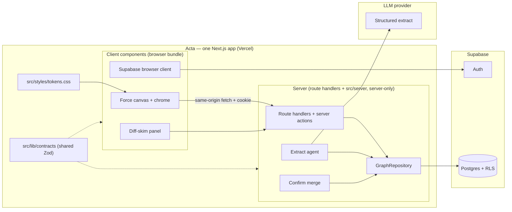

# feat: Acta technical implementation plan (U-J)

**Last updated:** 2026-08-03

**Owns:** HOW to implement locked product docs — stack defaults, module map, capture+render slice, persistence/auth path, agent/runtime seams, sequenced milestones, risks. Does **not** re-litigate product IA, schema kinds, or brand look.

**Companions:** [`building-plan.md`](building-plan.md) (roadmap), [`data-model.md`](data-model.md) (schema), [`agent-interaction-model.md`](agent-interaction-model.md) (write policy), [`surfaces-and-flows.md`](surfaces-and-flows.md) (chrome/flows), [`graph-canvas.md`](graph-canvas.md) (canvas behaviour — replaces the archived physics doctrine), [`src/styles/tokens.css`](../src/styles/tokens.css) (tokens; the up-front visual system is archived).

**Note on IDs:** Implementation units below (`U1`…) are **build milestones inside this plan**. Building-plan roadmap units remain **`U-A`…`U-J`**.

---

## Summary

Greenfield Acta as **one Next.js (App Router) app in the existing `Acta` repo** — UI + route-handler API in a **single Vercel deployment**, with `docs/` at the repo root and shared contracts folded into `src/lib/contracts`. Secrets stay **server-only** (route handlers / Server Components; guarded by the `server-only` package and the `NEXT_PUBLIC_` prefix boundary), on **thin Supabase Auth/Postgres from day one**, with **real LLM Extract** streaming into persisted proposals and an Obsidian-class force canvas. This plan commits recommended defaults with documented escape hatches so capture+render can ship without inventing architecture in chat.

---

## Problem Frame

Product, data model, Graph IA, and agent write policy are locked; the canvas and visual system are built and revised in slices instead (see [`graph-canvas.md`](graph-canvas.md)). Remaining blockers before code: keep LLM keys and the Supabase service role off the client (server-only in Next), map modules to docs, and sequence a dogfoodable **capture → extract → diff-skim → merge → canvas** loop with refresh-surviving proposals. (An earlier planning cycle removed a stale Next prototype and briefly targeted a Vite SPA + separate Hono API; that was reversed on 2026-07-20 — see KTD2 — back to a single Next app because founder velocity on Next/Vercel + one integrated deploy outweighs the backend-portability edge at this stage.)

---

## Requirements

- R1. Frontend and API live in **one Next.js app, one deployment**. The security boundary is the **server/client build split, not a separate host**: provider keys and the Supabase service role exist only in server code (route handlers / Server Components / server actions) and env vars *without* a `NEXT_PUBLIC_` prefix, and are never bundled into client JS. Server-only modules `import "server-only"` as a hard, build-enforced guard.
- R2. First dogfoodable loop is **typed Capture → real LLM Extract (incremental) → floating diff-skim + pending Endeavor ghosts → confirm/discard → force canvas of confirmed Endeavors**.
- R3. **Thin Supabase** (Auth + Postgres + RLS) is in the first loop — Captures, graph entities needed for canvas, and ExtractProposals persist across refresh.
- R4. Extract writes **proposals only** until confirm; Capture auto-save is the only silent write (see origin: `agent-interaction-model.md`).
- R5. Canvas follows [`graph-canvas.md`](graph-canvas.md): Endeavors only, seeded + pre-warmed so the first frame is settled, real per-node centre gravity (never `forceCenter` alone), small dots with captions gated on clear space, subtle edges, opaque overlays.
- R6. Design tokens live at [`src/styles/tokens.css`](../src/styles/tokens.css) (SoT), imported once in the root layout; Graph chrome overlays full-bleed canvas per [`surfaces-and-flows.md`](surfaces-and-flows.md).
- R7. Capture-pipeline logical tools from U-D map to HTTP (`create_capture`, `update_proposal`, `confirm_proposal`, `discard_proposal`, plus `retry_extract`); `extract_capture` is the **server-side** job started after Capture (not a separate FE-required call). Graph home also has `GET /graph` bootstrap (convenience over `list_endeavors` + edges — not a U-D tool name).
- R8. Explore, Deepen, adapters, fat onboarding import, and agent chat-history connectors are **path-documented**, not built in the first milestones.
- R9. Stack choices are **committed defaults with escape hatches** — changeable without rewriting product docs.
- R10. **Per-user auth is the real boundary.** Every non-public API route requires a valid Supabase JWT (verified via JWKS); unauthenticated → 401. Sensitive data is returned only to its authenticated owner. RLS (`user_id = auth.uid()`) backs this at the DB so a valid token still only sees its owner's rows.
- R11. **Abuse controls are first-class**, not afterthoughts: rate limiting on the API (per-user when authed, per-IP otherwise) and LLM spend caps. Basic rate limiting lands in U2; per-route/spend tuning by U4.
- R12. **Same-origin removes the CORS/client-key concern.** With UI and API in one origin there is no cross-origin browser boundary and no static client key to ship — those defense-in-depth hacks (`X-Acta-Client`, CORS allowlist) are **retired** as unnecessary. Auth is the only real gate (R10). If a separate public marketing site is ever added on another origin, revisit CORS then.
- R13. **Every unit ships with JSDoc doc-comments + unit tests** as a hard definition-of-done (see § Definition of Done and [`AGENTS.md`](../AGENTS.md)). Readable-top-to-bottom code and behavior tests are per-unit gates, not a later cleanup pass.

---

## Key Technical Decisions

| ID | Decision | Rationale |
| --- | --- | --- |
| KTD1 | **One repo, one Next.js app at repo root** — the existing `Acta` repo is the Next app (`src/app`, `src/lib`, `src/server`, …) with `docs/` at root; shared contracts folded into `src/lib/contracts`. One deployment | Founder is fluent in Next/Vercel; one clone, one deploy, no CORS, no workspace wiring. Security boundary preserved via the server/client build split (below), not a separate host. **Escape:** peel a heavy job into a separate worker/service later (see KTD3) without un-Nexting the app |
| KTD2 | **Next.js (App Router) for UI + API** — client components for the canvas island; route handlers (`src/app/api/*`) + server actions for the API; Server Components for non-canvas surfaces | **Reversed from Vite+Hono on 2026-07-20.** Founder velocity on Next/Vercel + one integrated app beats the backend-portability edge at this stage; AI SDK streaming is first-class on Next; `@supabase/ssr` gives **httpOnly cookie** sessions (safer than an SPA's in-JS token). **Escape:** the app stays plain React — a future Vite/other-host split is possible but not planned |
| KTD3 | **API = Next route handlers + server actions; domain logic in `src/server/*` behind `import "server-only"`** | Keeps HTTP plumbing thin and the real logic (GraphRepository, extract agent, merge) testable and isolated from client bundles. **Escape:** when a task outgrows the request cycle (bulk adapter imports, embeddings backfill), move *that job* to Vercel Cron / a queue (QStash/Inngest/Trigger.dev) or a dedicated worker — a partial peel, not a rewrite |
| KTD4 | **Hosting:** one **Vercel** project (UI + API); data/Auth on Supabase | Single deploy target; server code + secrets live server-side on Vercel, never in client JS. **Escape:** self-host Next on a Node container (Fly/Railway) if Vercel function limits bite for long-running work — or offload that work per KTD3 |
| KTD5 | ~~**Force canvas = `react-force-graph-2d`**~~ → **escape hatch taken 2026-07-26: custom `d3-force` + `<canvas>`** | The wrapper owned the tick loop, zoom transform, drag handling and redraw scheduling — i.e. everything the canvas is judged on — so it was replaced by our own simulation/camera/renderer/input modules. The recorded escape condition ("if the wrapper fights…") is exactly what happened. See [`graph-canvas.md`](graph-canvas.md) |
| KTD6 | **Streaming = route handler returning a `ReadableStream`** consumed via `fetch` (not browser `EventSource`) | Same-origin `fetch` with the cookie session; unidirectional extract chunks. **Escape:** NDJSON stream if framing is noise; WebSocket only if mid-stream bidirectional becomes core |
| KTD7 | **LLM = Vercel AI SDK** (`streamText` + `Output.object` / `Output.array`) **+ Zod**; provider via adapter (OpenAI or Anthropic) | Partial object stream for UI; final Zod validation before mergeable. Prefer `Output.array` + element stream for endeavor chunks. **Escape:** direct provider SDK + Zod |
| KTD8 | **Shared contracts folded into `src/lib/contracts`** (Zod + types), imported by both client and server code via the `@/lib/contracts` path alias | One app = one consumer; an internal module is simpler than a workspace package and there's no version skew. Schemas stay pure (no secrets, safe to import client-side). **Escape:** extract back into a published package only if a second consumer (e.g. native app) appears |
| KTD9 | **Supabase early, not memory-first** — dual clients: user JWT + RLS for interactive reads/PATCH; **service role + explicit `user_id` filter** for Extract job persistence and confirm merge (after JWT identity at job start / confirm) | Proposals survive refresh; Extract continues if the browser JWT expires mid-stream |
| KTD10 | **Capture slice state machine** (defaults) — see High-Level Technical Design. **v1 = batch confirm only** after `ready`; U-D optional chunk-confirm deferred | Closes races without reopening product IA |
| KTD11 | **Salvage former scaffold as patterns only** — port from git `5bece5b`: `src/domain/{common,entities,edges,extract,tags}.ts`, `src/server/graph/types.ts` (+ merge ideas from memory-repository), `supabase/migrations/20260710120000_init_graph.sql`. Reuse the shapes, not the old wiring | Blueprint paths, not a wholesale restore target |
| KTD12 | **Authenticate the *user*, layered auth** — Supabase session via `@supabase/ssr` (**httpOnly cookies**), verified in Next `middleware.ts` + per-route; RLS everywhere + anon/service-role key split. The secret boundary is server-only code + the `NEXT_PUBLIC_` prefix | Per-user identity (not any app-held key) is the only real gate for per-user data; httpOnly cookies keep the token out of JS. Same-origin means no CORS/client-header layer to maintain. See § Security Model |
| KTD13 | **Rate limiting at U2** in the API layer (keyed by user id when authed, else IP) with LLM spend caps by U4 | Protects the LLM bill. In-process is fine on a single Vercel region for MVP. **Escape:** a shared store (Upstash/Redis) once serverless instances fan out (in-process counters don't share state across lambdas) |

---

## High-Level Technical Design

### System map



| Concern | Lives in | Doc owner |
| --- | --- | --- |
| Entity/edge Zod + ExtractProposal shape | `src/lib/contracts` (+ server persist) | `data-model.md` |
| Capture → Extract → Proposal → Merge | `src/server/*` (route handlers call it) | `agent-interaction-model.md` |
| Force canvas, overlays, skim chrome | `src/features/*` (client) | `surfaces-and-flows.md`, `graph-canvas.md` |
| Tokens / visual | `src/styles/tokens.css` (imported in root layout) | itself — the prose visual system is archived; `graph-canvas.md` covers canvas visuals |
| Auth session | browser client + `middleware.ts` cookie verify | **U-E** detail inside this plan’s early milestones |

### Capture / proposal state machine (KTD10)

Statuses: `streaming` → `ready` | `failed`; `ready` → `merging` → `confirmed` | `discarded`; `failed` → Retry (back to `streaming`) | `discarded`.

| Rule | Default |
| --- | --- |
| Who starts Extract | BE **auto-starts** after Capture commit (logical `extract_capture`). Public HTTP: `POST /captures/:id/extract` = **retry** only (idempotent if already `streaming`) |
| Confirm while streaming | **Disabled** until `ready`. v1 = **batch confirm only**; U-D optional chunk-confirm deferred |
| User edits vs stream patches | Edits allowed after first chunk; stream must **not overwrite user-touched fields** |
| Extract runtime | **In-process detached task** on single-node BE; timeout → `failed`. **Escape:** queue worker later |
| Disconnect / refresh mid-stream | BE job **continues**; partial proposal persisted (service role + `user_id`); FE reattaches via `GET /proposals/:id` snapshot (+ optional `GET …/events?cursor=`) |
| Auth expiry mid-stream | Job keeps writing with service role (identity captured at start); FE refreshes session and reattaches; **Confirm** requires valid user JWT |
| Concurrent Capture+ while skim open | **Block** with finish-or-discard (≤1 open proposal in `streaming\|ready\|failed\|merging`) |
| Discard / failed Extract | **Keep Capture** row; no Capture inbox UI in first slice |
| Empty Extract | Status `failed` with reason `empty` — Retry/Discard only; Confirm disabled |

### HTTP route map (capture slice)

Paths below are logical; as Next route handlers they live under `/api/` (e.g. `POST /api/captures`) and authenticate via the httpOnly cookie session, same-origin.

| Method | Path | Notes |
| --- | --- | --- |
| `POST` | `/captures` | Create Capture; **auto-starts** Extract; returns `capture_id` + `proposal_id` |
| `POST` | `/captures/:id/extract` | Retry Extract (failed/aborted); idempotent if already streaming |
| `GET` | `/graph` | Bootstrap confirmed endeavors + edges (+ optional `open_proposal` summary) |
| `GET` | `/proposals/open` | Open proposal for hydrate (0..1 in v1) |
| `GET` | `/proposals/:id` | Full proposal snapshot (reattach) |
| `GET` | `/proposals/:id/events` | SSE; `?cursor=` for resume; cookie-session auth via `fetch` (not EventSource) |
| `PATCH` | `/proposals/:id` | User inline fixes (user JWT + RLS) |
| `POST` | `/proposals/:id/confirm` | Merge transaction; idempotent |
| `POST` | `/proposals/:id/discard` | Drop proposal; keep Capture |

### Streaming event lean (directional)

SSE events (names indicative): `proposal_upsert`, `endeavor_preview_upsert`, `changelog_append`, `stream_done`, `stream_error`. Changelog is append/patch — not a full rewrite every token. Partial streams drive UI only; **final Zod-validated payload** is what Confirm merges.

### Auth & secrets

| Context | Allowed |
| --- | --- |
| Client (browser bundle) | `NEXT_PUBLIC_SUPABASE_URL` + **publishable/anon** key only |
| Server (route handlers / Server Components / `src/server/*`) | LLM keys, Supabase **service role** (Extract job writes + confirm merge), session verification via `@supabase/ssr` — all from non-`NEXT_PUBLIC_` env |
| Never | Service role or LLM keys in `NEXT_PUBLIC_*` or any client-imported module |

Same-origin, so no CORS layer. Secret isolation is enforced by the `NEXT_PUBLIC_` prefix + `import "server-only"` on server modules. See § Security Model & Threat Boundaries.

### Persistence lean

Revive and extend former `supabase/migrations/20260710120000_init_graph.sql` patterns:

- Entity tables + `edges` as already sketched.
- New **`extract_proposals`**: `id`, `user_id`, `capture_ids[]`, `status`, `payload jsonb`, `changelog jsonb`, `pending_endeavor_previews jsonb`, `failure_reason?`, `stream_cursor?`, timestamps.
- RLS: `user_id = auth.uid()` for user-scoped clients (reads + user PATCH). Extract stream upserts + confirm merge: **service role + explicit `user_id` filter** after identity check at job/confirm start.
- Canonical physical lean also in [`data-model.md`](data-model.md) (§ ExtractProposal persistence); keep **state-machine rules here** and avoid duplicating column lists when they change.

---

## Security Model & Threat Boundaries

**Core principle: authenticate the *user*, never the *app*; keep secrets in server code.** Two boundaries do the real work and both survive collapsing UI + API into one Next app:

1. **The server/client build split.** Server code (route handlers, Server Components, `src/server/*`) and any env var *without* `NEXT_PUBLIC_` never ship to the browser. `import "server-only"` makes an accidental client import a **build error**. This replaces "secrets on a separate host" with a compiler-enforced boundary in one deploy.
2. **The database boundary.** Supabase is still a separate service and **RLS is still the real gate** for per-user data — the boundary that holds even if everything else fails.

The user's credential is a **Supabase session in httpOnly cookies** (`@supabase/ssr`), which the browser's JS cannot read — strictly safer than an SPA holding a token in JS-accessible storage.

### Layers (strongest → weakest)

| Layer | What it enforces | Strength |
| --- | --- | --- |
| **RLS on every user table** (`user_id = auth.uid()`) | A valid session still only reads/writes its owner's rows; User B can't see User A's data | **Boundary** (DB-enforced) |
| **Session required on non-public routes** (verified in `middleware.ts` + per-route via `@supabase/ssr`) | Only authenticated users reach sensitive routes; unauthenticated → 401 | **Boundary** |
| **Server/client code + env split** (`server-only`, no `NEXT_PUBLIC_` on secrets) | Service role + LLM keys never reach client JS | **Boundary** (build-enforced) |
| **anon/service-role key split** | Browser holds only the RLS-bound anon key; service role (bypasses RLS) is server-only, used with an explicit `user_id` filter after identity check | **Boundary** |
| **httpOnly cookie session** | Token not readable by page JS → shrinks XSS token-theft surface | Control |
| **Rate limiting + LLM spend caps** | Caps abuse/cost even from authenticated callers | Control (not identity) |

### Not achievable (stated plainly)

- **Provably "only my official web build" calls the API.** Not solvable for web apps. App attestation (App Attest / Play Integrity) exists only for native mobile. Realistic mitigations if abuse appears: bot protection (e.g. Cloudflare Turnstile on signup), tighter rate limits — *later*, not now.

### Retired with the Vite→Next move

- **CORS allowlist** and the **`X-Acta-Client` static header** are gone: same-origin means no cross-origin browser boundary and no key to ship. They were explicitly defense-in-depth, never real boundaries, so nothing of substance is lost. Re-introduce CORS only if a separate-origin surface (e.g. a marketing site) later calls the API.

### `src/lib/contracts` is not an attack surface

It is compile-time TypeScript/Zod, not a network service, and holds no secrets — safe to import from client code. Nothing to enforce at runtime.

---

## Output Structure

Expected layout (names indicative) — **one Next.js app at repo root**:

```text
Acta/                    # existing repo root (git) = the Next app; one Vercel deploy
  package.json           # next, react, zod; scripts: dev/build/start/lint/test
  next.config.ts
  tsconfig.json          # @/* -> ./src/*
  middleware.ts          # Supabase session refresh + auth gating (U2)
  .env.example           # NEXT_PUBLIC_* (client) + server-only secrets
  docs/                  # planning SoT (this folder) — stays at root
  supabase/migrations/   # DB migrations (added at U2)

  src/
    app/
      layout.tsx         # root layout; imports styles/tokens.css once
      page.tsx           # Graph home shell (client canvas island; U1 health shell for now)
      (auth)/login/      # sign in (placeholder → U2); /auth/callback route handler at U2
      settings/          # account, connectors, export (placeholder → U2/U-E)
      generate/          # adapter picker (placeholder → U6/U-F)
      adapters/[kind]/   # adapter workspace (placeholder → U-F)
      api/               # route handlers — the API
        health/route.ts  meta/route.ts   # (U1)
        captures/  proposals/  graph/  extract/   # (U2–U5)
    components/          # shared UI (e.g. placeholder-surface)
    features/
      graph/             # engine/ + surfaces/ + lab/ (client, graph app on `/home`)
      capture/           # composer + diff-skim panel (overlay on `/home`, not a route)
    lib/
      contracts/         # shared Zod + types (folded from @acta/contracts)
      supabase/          # server.ts (service-role + user-scoped) / client.ts (anon)
      api/               # client fetch + SSE helpers
    server/              # 'server-only' domain logic
      graph/             # GraphRepository
      agents/extract/    # AI SDK structured extract
      merge/             # confirm merge
    styles/tokens.css    # design tokens — single source of truth
```

Route map (URL ↔ surface, incl. which surfaces are overlays vs routes) lives in [`surfaces-and-flows.md`](surfaces-and-flows.md) § Route map.

Implementers may adjust folders; contract ownership and the `server-only` boundary must stay clear. There is **one deploy**; the security boundary is the server/client split — client-imported modules must never pull in secrets or `src/server/*`.

---

## Scope Boundaries

### In scope (this plan → first build wave)

- Next.js app scaffold at repo root (App Router, route handlers, contracts folded into `src/lib/contracts`)
- Supabase project, Auth, migrations (graph + proposals), RLS
- Capture+render dogfood loop with real LLM + SSE + force canvas
- Path notes for Explore / thin Generate / full **U-E** polish

### Deferred to follow-up work

- Fat onboarding import (resume / LinkedIn / GitHub) live-build
- Explore NL, filters depth, Deepen backlog, Stories stamp UI
- Adapter pages (**U-F**), rich provenance (**U-G**), empty/copy polish (**U-H**/**U-I**)
- Agent chat-history connectors
- Embeddings / pgvector retrieve for Explore (migration may create columns; don’t wire until Explore)
- Voice mic behavior (chrome may exist; behavior later)

### Outside this plan’s job

- Reopening locked IA, kinds, or brand look
- Monetization / GTM / domain / legal
- Claiming the HTML mock’s exact physics numbers as canon

---

## Definition of Done (every unit)

Each unit's per-unit **Test scenarios** are the *minimum*, not the ceiling. A unit is not "done" until all of the following hold — this applies to **every** unit below, not just the ones that mention it:

- **JSDoc doc-comments** on all new/changed code, per [`AGENTS.md`](../AGENTS.md): every file has a `@fileoverview`; every function/method/hook/component has a JSDoc block (summary, `@param`, `@returns`, `@throws`); exported types/Zod schemas get a one-line concept doc. Explain intent, not syntax; no narration comments in bodies.
- **Unit tests for behavior-bearing code** — new behavior gets new tests, changed behavior gets updated tests. Cover happy path + meaningful edge/error paths, not just the listed scenarios. Pure config/styling is exempt.
- **`npm run typecheck` clean**; **lint clean**; **`next build` succeeds**.
- **No secrets in the client bundle** (service-role / LLM keys never in `NEXT_PUBLIC_*` or any client-imported module; server logic guarded by `server-only`).
- **Docs kept in sync** — if a decision changes, update the relevant `docs/` file + changelog in the same change.

Rationale: quality is built in per unit (readable code + tests), not bolted on later. See `AGENTS.md` for the doc-comment rule detail.

---

## Implementation Units

### U1. Next app scaffold + contracts

- **Goal:** Next.js (App Router) app at repo root; Zod ExtractProposal/entity types ported from KTD11 salvage paths into `src/lib/contracts`; both a client component and a route handler import the same contracts via the `@/lib/contracts` alias; design tokens live at `src/styles/tokens.css` (SoT), imported in the root layout. Root `AGENTS.md` + `.cursor/rules/` carry the JSDoc doc-comment rule.
- **Requirements:** R1, R9
- **Dependencies:** None
- **Files:** `package.json`, `next.config.ts`, `tsconfig.json`; `src/app/layout.tsx`, `src/app/page.tsx`, `src/app/api/{health,meta}/route.ts`; `src/lib/contracts/*`; `src/styles/tokens.css`
- **Approach:** Single app, no workspaces (KTD1/KTD8). No product UI yet beyond a health shell + `/api/health` + `/api/meta`.
- **Test scenarios:**
  - Contracts exports parse a minimal valid ExtractProposal and reject missing endeavor title.
  - Client page and `/api/meta` route resolve the same `@/lib/contracts`.
- **Verification:** `next build` succeeds; client bundle contains no secrets; `.env.example` has no service-role / LLM keys under `NEXT_PUBLIC_`.
- **Status:** ✅ shipped 2026-07-20 (migrated from the interim Vite+Hono U1).

### U2. Supabase Auth + schema + RLS

- **Goal:** Migrations for captures, endeavors, edges (minimal canvas set), children stubs as needed for merge, and `extract_proposals`; cookie-session Auth works via `@supabase/ssr`; protected routes require a valid session; RLS on all user tables; basic rate limiting (per § Security Model).
- **Requirements:** R3, R4, R10, R11
- **Dependencies:** U1
- **Files:** `supabase/migrations/*`; `middleware.ts` (session refresh + gating); `src/lib/supabase/{server,client}.ts`; `src/app/(auth)/*`; rate-limit helper for route handlers
- **Approach:** Port init SQL from git history; add proposals table; RLS on all user tables; dual Supabase clients (user-scoped vs service role for merge); `@supabase/ssr` cookie sessions verified in `middleware.ts` + per protected route; rate-limit keyed by user id (else IP).
- **Test scenarios:**
  - Authenticated user can insert own Capture; cannot read another user’s rows (`SET ROLE authenticated` style checks).
  - Unauthenticated call to a protected route returns 401.
  - Proposal row with `user_id` A is invisible to user B under RLS.
  - Exceeding the rate limit returns 429.
- **Verification:** Sign-in works; a server route returns the auth subject for the session; migrations apply cleanly on empty project; client bundle still contains no service-role/LLM keys.
- **Status:** ✅ shipped 2026-07-21. Notes: session verification uses `supabase.auth.getClaims()` (local JWKS/WebCrypto verify — satisfies the "prefer JWKS" preference without a per-request network call), so the separate `SUPABASE_JWKS_URL` env var was **retired** (derived from `NEXT_PUBLIC_SUPABASE_URL`). The Next gate is `src/proxy.ts` (Next 16 renamed `middleware.ts` → `proxy.ts`; Node runtime). Auth method = **magic link only**. Migrations run **locally** (`supabase/config.toml`, option (a)) then apply to `acta-dev` via the Supabase GitHub integration on merge to `main` (not pasted into the SQL Editor). RLS isolation is covered by an **auto-skipping integration test** (`src/server/rls.integration.test.ts`, runs only when local DB env is set); CI runs the pure-logic tests (gating, rate-limit).

### U3. Graph bootstrap + force canvas (confirmed nodes)

- **Goal:** Graph home full-bleed canvas renders confirmed Endeavors from API; pre-warm + cluster-seed; tokens applied; empty state = quiet canvas + Capture CTA.
- **Requirements:** R5, R6
- **Dependencies:** U2
- **Files:** `src/features/graph`; `GET /api/graph` (or endeavors+edges) bootstrap route
- **Approach (revised 2026-07-26):** **our own loop** — `d3-force` stepped one tick per `requestAnimationFrame` onto a plain `<canvas>`, with our own camera, renderer, and pointer handling. The first attempt used `react-force-graph-2d` and could not reach the qualities the canvas is judged on, because that library owns the simulation loop, the zoom transform, drag handling, and redraw scheduling. Node objects still hold their own position/velocity so a snapshot refresh nudges the layout instead of restarting it. Fixture endeavors (hand-authored, plus a generator for scale) remain the way layout is dogfooded before Extract lands.
- **Execution note:** Prefer characterization of graphData identity (no remount on unrelated React state) early.
- **Test scenarios:**
  - Bootstrap with N endeavors paints N nodes; refresh shows same set.
  - Empty user sees zero nodes + Capture CTA.
  - Opening a stub right panel shifts force center left (not CSS-translated canvas).
  - Reduced-motion: land fully settled with no animated settle scramble (pending pulse covered in U4).
- **Verification:** Dogfood on `/home` and `/lab/graph`: hover, selection, left detail panel, full chrome verified on screen (2026-08-03).
- **Status:** ✅ **U3 canvas engine + interaction slice shipped** (rebuilt 2026-07-26; interaction polish verified 2026-07-28). See [`graph-canvas.md`](graph-canvas.md) for the live spec and module map.

  **What landed:** `engine/simulation.ts`, `engine/camera.ts`, `engine/render.ts`, `engine/seed.ts`, `engine/palette.ts`, `engine/graph-canvas.tsx` (RAF loop, our own `d3-force` tick), `surfaces/graph-home.tsx` (fetch + full Neubrutalism chrome on `/home`), `lab/dev-hud.tsx` + `/lab/graph` workbench. Hover peek + detail panel live inline in `graph-home.tsx`. Verification: look at `/lab/graph` and `/home`; `src/test/graph/layout-shape.test.ts` guards the real engine (roundness, locality, shimmer).

  **Parallel (U-A, not U3 exit):** Neubrutalism tokens, `/` waitlist landing — see [`design-handoff.md`](design-handoff.md). **Light mode only** (dark deferred).

  **Still deferred to later units:** ask ranking, filter wiring, capture composer, deepen backlog, Explore/diff-skim behavior, NL ranking, real deepen signal — chrome is visible on `/home` but inert until U4–U6.

  **Removed with first attempt:** `react-force-graph-2d`, centered modal + scrim, full chrome built in one pass, Playwright screenshot scripts.

  **Previous status (superseded 2026-07-25):** UI-complete canvas + all chrome in one pass — scrapped; do not treat as current.

### U4. Capture + LLM Extract stream + proposal persistence

- **Goal:** Typed yap → Capture row → BE Extract (AI SDK) streams SSE patches → proposal `streaming`→`ready`/`failed` persisted; FE shows changelog + pending ghosts incrementally.
- **Requirements:** R2, R3, R4, R7
- **Dependencies:** U2, U3
- **Files:** `src/app/api/*` capture/extract/proposal routes + `src/server/agents/extract`; `src/features/capture` + skim
- **Approach:** Auto-start Extract after Capture; `Output.array` (or object) for endeavor previews; persist partials via service role + `user_id`; final Zod validate before `ready`. Apply KTD10 concurrency/auth/runtime rules.
- **Test scenarios:**
  - Capture exists in DB before first SSE event; empty/whitespace Capture rejected before Extract.
  - Mid-stream refresh restores partial proposal + ghosts via snapshot/cursor; no duplicate Capture.
  - User-touched field is not overwritten by a later stream patch.
  - Extract failure or BE process kill mid-extract → `failed` + Retry without second Capture.
  - Empty model output → `failed`/`empty`; Retry/Discard only.
  - JWT refresh mid-stream then Confirm still succeeds with valid session.
  - Second Capture+ while open proposal → blocked with message.
  - Client bundle contains no LLM API keys.
- **Verification:** End-to-end yap with real provider key on BE only; pending nodes animate in; refresh survives.

### U5. Inline edit, confirm merge, discard

- **Goal:** Patch proposal; Confirm merges into graph (dedup lean from data-model); Discard drops proposal/ghosts and keeps Capture; update-ops overlay existing nodes.
- **Requirements:** R2, R4, R7
- **Dependencies:** U4
- **Files:** proposal PATCH/confirm/discard; merge transaction in GraphRepository
- **Approach:** Idempotent confirm; service role merge only after JWT check; do not clobber stamped stories (N/A until Stories ship — still don’t invent story writes).
- **Test scenarios:**
  - Edited title wins over raw LLM text on Confirm.
  - Confirm → ghosts become committed; proposal terminal; second Confirm is no-op/409.
  - Discard → ghosts gone; Capture retained; graph unchanged.
  - Update proposal on existing endeavor → one node, not a duplicate.
  - Two tabs: one Confirm; other hydrate shows merged graph.
- **Verification:** Full capture+render loop dogfoodable on real Auth/DB/LLM.

### U6. Path to Explore, thin Generate, and U-E polish

- **Goal:** Document (in this file’s Future path + thin stubs only if useful) how Explore SSE/REST, adapter routes, and remaining **U-E** items (export, hard-delete, connector OAuth) attach without blocking capture+render.
- **Requirements:** R8
- **Dependencies:** U5
- **Files:** short “Next surfaces” section below; optional no-op route stubs — prefer docs over fake UI
- **Approach:** No Explore ranking or adapter draft logic in this unit — sequencing clarity only.
- **Test expectation:** none — documentation / roadmap unit
- **Verification:** Builder can start Explore or auth polish without redesigning workspace boundaries.

---

## Phased Delivery

```text
U1 Next app + contracts
    → U2 Auth + schema + RLS
        → U3 Canvas bootstrap
            → U4 Capture + LLM stream + proposals
                → U5 Edit / confirm / discard   ← dogfoodable capture+render
                    → U6 Path notes
                        → Explore / thin Generate / U-E extras / U-F…
```

**Dogfood gate:** after U5, a real user can sign in, yap, watch pending endeavors stream onto the graph, confirm, refresh, and see the same committed graph.

---

## Alternative Approaches Considered

| Approach | Why not default |
| --- | --- |
| **Vite SPA + separate Hono API** (interim default, 2026-07-17 → 2026-07-20) | Superseded 2026-07-20 (KTD2). Cleaner backend portability + a zero-server static FE, but it cost founder velocity (founder is fluent in Next/Vercel), added CORS + two deploys + a shared-contracts package, and forced client-side token storage. The one integrated Next app wins at this stage. **Revisit** if the backend grows into heavy long-running/multi-runtime work that a request-cycle model fights — then peel a worker per KTD3. |
| Separate git repos FE+BE (original U-J default) | Superseded 2026-07-17, then moot under one Next app. One repo, one deploy. |
| Memory repository until U-E | Rejected by founder — thin Supabase from first loop |
| Fixture/heuristic Extract before LLM | Rejected — pay for real Extract in first slice; keep heuristic only as test double |
| Edge Functions as primary backend | Wall-clock/CPU limits poor fit for long extract streams |
| Sigma/WebGL graph day one | Overkill for tens–low-hundreds of endeavors |

---

## Risks & Dependencies

| Risk | Mitigation |
| --- | --- |
| Proxy buffering kills SSE | Disable buffering; keepalive comments; test on real BE host early |
| AI SDK partials treated as mergeable | UI-only until final Zod `ready` |
| Layout restarting on unrelated state changes | Node objects hold their own position/velocity and are reused across snapshots; a re-settle on anything but membership change is a bug |
| Service role bypasses RLS | Dual clients; ownership checks in merge |
| Supabase key/JWT migration (publishable keys, asymmetric JWT) | Prefer JWKS verify; avoid HS256 secret forever |
| LLM cost / stuck streaming jobs | Spend caps; job timeout; failed status + Retry; one open proposal |
| Contracts version skew | Pin versions; CI fails on breaking Zod changes |
| Docs vs code drift on proposals | Keep `data-model.md` physical lean + this plan’s KTD10 in sync when columns/statuses change |

**Dependencies:** Supabase project; LLM provider account; one Vercel project (or a self-hosted Next container). Contracts are an internal module (`src/lib/contracts`) — no registry needed.

---

## System-Wide Impact

- **Auth boundary:** every graph mutation is user-scoped (session + RLS); LLM/service-role keys are server-only (build-enforced via `server-only` + no `NEXT_PUBLIC_`). Per-user identity is the real gate; same-origin drops CORS/client-header entirely (see § Security Model).
- **Data lifecycle:** Captures immutable; proposals **persisted** until confirm/discard (then drop/archive) — not durable graph SoT; merged entities durable.
- **Performance:** pre-warm + park the render loop at rest; repulsion is range-capped (d3's many-body is already Barnes–Hut). Measured 109–127 fps at 140 nodes and mid-drag at 400 (per graph-canvas).
- **Repo role:** one repo = the Next app + planning SoT (`docs/`) at root; keep README/building-plan in sync as units land.

---

## Future path (post dogfood)

1. **Explore** — `explore_nl` on BE (embeddings optional); FE ask bar + highlight language shared with filters.
2. **Thin Generate** — hamburger → adapter routes; citation click → focus endeavor; no full **U-F** editors yet.
3. **U-E extras** — export, hard-delete confirm, connector OAuth, proposal archive UX.
4. **Onboarding import** — same skim language, live pending build.
5. **U-F → U-G → U-H → U-I** per building-plan.

---

## Open Questions

- [ ] Exact LLM provider for v1 (OpenAI vs Anthropic) — either works behind AI SDK; pick at U4.
- [ ] Selected vs highlighted vs dimmed visual triad — still open. U3 shipped **highlight + hover lift only**, with selection expressed by the node modal; revisit once real graph density shows whether dimming is needed.
- [x] Repo structure — **resolved 2026-07-17; revised 2026-07-20:** one repo = a single Next.js app at root (`src/*`), contracts folded into `src/lib/contracts`, `docs/` at root. Not renamed.
- [x] FE framework — **resolved 2026-07-20:** Next.js (App Router), reversing the interim Vite+Hono choice (KTD2).
- [ ] Rate-limit store — in-process is fine for a single-region MVP; move to a shared store (Upstash/Redis) once serverless instances fan out (counters don't share across lambdas). Decide at first scale.
- [ ] Long-running work offload — which mechanism (Vercel Cron / queue / worker) for adapter imports + embeddings backfill; decide when that work lands (KTD3).

---

## Sources & Research

- Locked specs under `docs/` (product, data-model, surfaces, agents, building-plan) + the live canvas spec (`graph-canvas.md`).
- Former scaffold patterns from git `5bece5b` (Zod domain, GraphRepository, init SQL) — patterns only.
- External shortlist (2026): Next.js App Router + route handlers + `react-force-graph-2d` + fetch-SSE + AI SDK structured output + `@supabase/ssr` + Vercel/Supabase.
- Framework constraints: AI SDK `Output.*` (not deprecated `streamObject`); Supabase sessions via `@supabase/ssr` (httpOnly cookies); EventSource unsuitable for authed streaming (use `fetch` + `ReadableStream`); serverless function time limits → offload long jobs (KTD3).

---

## Changelog

- **2026-08-03:** **U3 status block rewritten** to match current code: canvas + hover/selection/detail on `/home`; chrome inert until U4–U6; light mode only. Added [`docs/file-catalogue.md`](file-catalogue.md) and [`docs/design-handoff.md`](design-handoff.md).

- **2026-07-26 (later):** **U3 canvas rebuilt on our own render loop; the wrapper is gone.** The retuned layout passed its own measurements and still looked wrong on screen — the diagnosis was architectural, not numerical: with `react-force-graph-2d` owning the tick loop, the zoom transform, drag handling and redraw scheduling, the qualities the canvas is judged on were unreachable from outside. Now ours: [`simulation.ts`](../src/features/graph/simulation.ts), [`camera.ts`](../src/features/graph/camera.ts), [`render.ts`](../src/features/graph/render.ts), [`seed.ts`](../src/features/graph/seed.ts), [`graph-canvas.tsx`](../src/features/graph/graph-canvas.tsx). Three things worth carrying forward beyond this unit: **(1)** captions are gated on *measured clear space* around a node, not a zoom threshold, so overview views are quiet and zooming in reveals names; **(2)** front-end work is now verified in a browser — a dev-only `/lab/graph` workbench (URL-settable forces + a fixture generator up to 600 nodes) plus `npm run shots` / `npm run shots:compare`, which capture fit/zoom/drag states and stitch candidate settings into one comparable image; **(3)** [`layout-shape.test.ts`](../src/features/graph/layout-shape.test.ts) measures the **real** engine, replacing a test that re-implemented the forces and could therefore pass while the screen was wrong. Measured: aspect ratio 1.00–1.06 across 19/26/140/400 nodes, furthest node 1.3–1.7× the median radius, 109–127 fps including mid-drag at 400 nodes. `npm run check` + `next build` green. Docs: [`graph-canvas.md`](graph-canvas.md) replaces the archived physics doctrine and visual system; [`AGENTS.md`](../AGENTS.md) gained a front-end working agreement (build in verified slices; don't specify visuals ahead of building them; own the loop; numbers guard, eyes decide; no translucency over live content).
- **2026-07-26:** **U3 layout fix — the canvas now honours the physics doctrine.** The shipped U3 graph settled as a stringy sprawl parked off-centre; four causes, all fixed and now measured rather than eyeballed. (1) **No gravity existed**: `forceCenter` only translates the centroid, so `forceX`/`forceY` now supply real cohesion; (2) charge reach is **capped** at ~4× link distance instead of inflating the whole graph; (3) shared facets are wired as **hub-and-spoke stars capped at two derived links per endeavor** instead of arbitrarily ordered chains; (4) cluster centres are ordered around the seeding ring by **link affinity** instead of alphabetically. Framing is fitted after the engine stops. New: [`src/lib/graph/derive-endeavor-links.ts`](../src/lib/graph/derive-endeavor-links.ts) — one isomorphic link rule shared by the server projection and the sample fixture, so the fixture can no longer flatter the layout — and [`layout-quality.test.ts`](../src/features/graph/layout-quality.test.ts), which settles the sample graph *and* a denser synthetic graph in a headless `d3-force` run and asserts crossings, bounding-box roundness, radial fill, overlaps, and edge length. Retuned defaults (gravity `0.09`, link distance `40`, repel `320`) land the sample graph at **zero crossings** and a square-ish bounding box. `npm run check` green. See graph-physics + data-model changelogs.
- **2026-07-25:** **U3 shipped — Graph home canvas + chrome.** `GraphSnapshot` contract + `GET /api/graph` (RLS-scoped repository read, pure projection of endeavors/edges/facets into canvas nodes and weighted links) + `src/features/graph/*`: `react-force-graph-2d` canvas with cluster-seeded pre-warm, degree-scaled nodes, hairline straight edges with halo'd labels, hover lift, panel-driven centre-of-gravity shift, ask + filter + graph-settings chrome, hover card, node modal, floating panels, quiet empty state, and `html[data-mode]` theming with a flash-free boot script. Fonts wired via `next/font`. Decisions: endeavors are the only physics bodies (facets project into endeavor↔endeavor links, hub facets chained + capped); node identity is held outside React so unrelated state can't restart the layout; canvas colour/type resolved from tokens per theme; highlight-only (no dim) and drag-release rejoins the simulation. Deferred and labelled in-product: NL ask ranking (Explore), deepen thinness signal, capture composer (U4). `npm run check` + `next build` green. See building-plan, brand-design-system §13, and graph-physics changelogs. Next = **U4** (Capture + Extract stream).
- **2026-07-21:** **U2 shipped — Supabase Auth + schema + RLS + rate limiting.** Ported the graph schema (Acta-branded) + added the `extract_proposals` table under `supabase/migrations/`; dual Supabase clients (`src/lib/supabase/{client,server}.ts` — anon+RLS vs `server-only` service role); Next 16 **`src/proxy.ts`** session gate (refresh + gate via `getClaims()` local JWKS verify); magic-link `/login` + `/auth/callback`; in-process per-IP/route rate limiter (`src/server/rate-limit.ts`, 429 + `Retry-After`). Decisions: auth = **magic link only**; **`SUPABASE_JWKS_URL` retired** (getClaims derives JWKS from the project URL); migrations tested locally (`supabase/config.toml`) and deployed to `acta-dev` via the **Supabase GitHub integration** on merge to `main`. RLS isolation verified by an **auto-skipping integration test** (needs local DB env); CI covers gating + rate-limit logic. `npm run check` + `next build` green.
- **2026-07-20:** **Reversed FE stack to Next.js (App Router); collapsed to one app.** KTD2 flipped from Vite SPA + separate Hono API to a **single Next app at repo root** (KTD1) — UI + route-handler API in one Vercel deploy. `acta-web`/`acta-api` retired; `@acta/contracts` folded into `src/lib/contracts`; tokens SoT → `src/styles/tokens.css`. Security model reframed around the **server/client build split + `server-only` + httpOnly cookie sessions** (`@supabase/ssr`); **CORS + `X-Acta-Client` retired** (same-origin) — R12 reframed, KTD3/KTD4/KTD6/KTD8/KTD12/KTD13 updated, U1/U2 rewritten, Output Structure + diagram + Security Model replaced. Rationale: founder velocity on Next/Vercel + integrated deploy beat backend portability at this stage; tax is offloading long jobs later (KTD3). U1 re-shipped on Next (health shell + `/api/health` + `/api/meta`, contracts + route tests green).
- **2026-07-20:** **U1 hardening pass** — modernized contracts to Zod v4 idioms (`z.uuid()` / `z.url()` / `z.iso.datetime()`); pinned **TypeScript 5.x** (ecosystem tooling doesn't yet support TS 7 native); added root **ESLint (flat) + Prettier** baseline (`lint`/`format`/`check` scripts); split acta-api into a side-effect-free app factory (`index.ts`) + runnable `server.ts` so routes are testable; added acta-api **vitest** health/meta/CORS tests. Added deploy-bundling note for `@acta/contracts` (unpublished workspace package must ship with the API build).
- **2026-07-20:** **Added § Definition of Done + R13** — JSDoc doc-comments and unit tests are now explicit per-unit gates for *every* unit (plus typecheck/lint clean, no FE secrets, docs in sync). Testing was already per-unit via Test scenarios; this makes doc-comments a first-class gate too.
- **2026-07-20:** **Added § Security Model & Threat Boundaries** + requirements R10–R12 and KTD12–KTD13. Codifies: authenticate the user (JWT+JWKS) not the app; RLS everywhere; anon/service-role split; rate limiting (U2) + spend caps (U4); the `X-Acta-Client` header as **defense-in-depth only** (non-secret, never gates data); and what's not achievable (provably "only my web build"). Folded JWT/RLS/rate-limit/client-header into U2.
- **2026-07-20:** **U1 shipped** (workspaces + `@acta/contracts` + health-shell FE/API). **Design-token SoT moved to `acta-web/src/styles/tokens.css`** — root `styles/` removed; token references across docs repointed. Added CORS middleware to acta-api (WEB_ORIGIN allowlist) so the browser can reach the API.
- **2026-07-17:** **Repo structure changed from polyrepo → one repo, workspace subfolders** (`acta-web` / `acta-api` / `acta-contracts`, `docs/` at root of existing `Acta` repo). Security boundary now = separate deploy hosts + BE-only secrets, not a git split. Updated Summary, R1, KTD1, KTD8, Output Structure, U1, Alternative Approaches, Dependencies, System-Wide Impact. U1 also mirrors the JSDoc doc-comment rule into code subfolders.
- **2026-07-15:** Confidence pass — HTTP route map; extract runtime + dual-client write rules; KTD8 `file:` first; batch-confirm v1; stronger U4 tests.
- **2026-07-15:** U-J created — polyrepo FE/BE, thin Supabase + real LLM capture+render plan, committed defaults with escape hatches.
