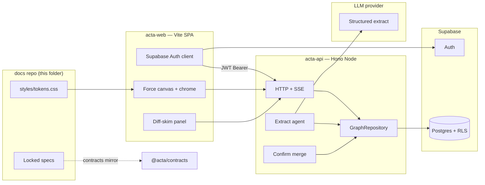

# feat: Acta technical implementation plan (U-J)

**Last updated:** 2026-07-15

**Owns:** HOW to implement locked product docs — stack defaults, module map, capture+render slice, persistence/auth path, agent/runtime seams, sequenced milestones, risks. Does **not** re-litigate product IA, schema kinds, or brand look.

**Companions:** [`building-plan.md`](building-plan.md) (roadmap), [`data-model.md`](data-model.md) (schema), [`agent-interaction-model.md`](agent-interaction-model.md) (write policy), [`surfaces-and-flows.md`](surfaces-and-flows.md) (chrome/flows), [`graph-physics.md`](graph-physics.md) (canvas behavior), [`brand-design-system.md`](brand-design-system.md) + [`styles/tokens.css`](../styles/tokens.css) (visual).

**Note on IDs:** Implementation units below (`U1`…) are **build milestones inside this plan**. Building-plan roadmap units remain **`U-A`…`U-J`**.

---

## Summary

Greenfield Acta as **two separately hosted repos** (Vite React SPA + Hono API) on **thin Supabase Auth/Postgres from day one**, with **real LLM Extract** streaming into persisted proposals and an Obsidian-class force canvas. This plan commits recommended defaults with documented escape hatches so capture+render can ship without inventing architecture in chat.

---

## Problem Frame

Product, data model, Graph IA, agent write policy, brand look, and graph-physics doctrine are locked. The old Next monolith was removed so planning isn’t fighting dead UI. Remaining blockers before code: choose a stack that keeps LLM keys and service role off the client, map modules to docs, and sequence a dogfoodable **capture → extract → diff-skim → merge → canvas** loop with refresh-surviving proposals.

---

## Requirements

- R1. Frontend and backend live in **separate repos** and are **separately hosted**; provider keys and Supabase service role exist only on the backend.
- R2. First dogfoodable loop is **typed Capture → real LLM Extract (incremental) → floating diff-skim + pending Endeavor ghosts → confirm/discard → force canvas of confirmed Endeavors**.
- R3. **Thin Supabase** (Auth + Postgres + RLS) is in the first loop — Captures, graph entities needed for canvas, and ExtractProposals persist across refresh.
- R4. Extract writes **proposals only** until confirm; Capture auto-save is the only silent write (see origin: `agent-interaction-model.md`).
- R5. Canvas follows [`graph-physics.md`](graph-physics.md): Endeavors only, cluster-seed + pre-warm, CoG shift via force center (not CSS translate), pending styling per brand.
- R6. FE imports [`styles/tokens.css`](../styles/tokens.css); Graph chrome overlays full-bleed canvas per [`surfaces-and-flows.md`](surfaces-and-flows.md).
- R7. Capture-pipeline logical tools from U-D map to HTTP (`create_capture`, `update_proposal`, `confirm_proposal`, `discard_proposal`, plus `retry_extract`); `extract_capture` is the **server-side** job started after Capture (not a separate FE-required call). Graph home also has `GET /graph` bootstrap (convenience over `list_endeavors` + edges — not a U-D tool name).
- R8. Explore, Deepen, adapters, fat onboarding import, and agent chat-history connectors are **path-documented**, not built in the first milestones.
- R9. Stack choices are **committed defaults with escape hatches** — changeable without rewriting product docs.

---

## Key Technical Decisions

| ID | Decision | Rationale |
| --- | --- | --- |
| KTD1 | **Two repos + separate hosts** — `acta-web` (FE) and `acta-api` (BE); this Stilva folder remains the **docs/specs + tokens** home until renamed | User security requirement; docs stay the single product SoT |
| KTD2 | **FE = Vite + React SPA** (React Router or TanStack Router) | Canvas-first, auth-gated app; avoids putting secrets on a Next host via Server Actions. **Escape:** Next App Router mostly `"use client"` if marketing SSR is needed later |
| KTD3 | **BE = Hono on Node 22** (`@hono/node-server`) | Web-standard Request/Response → SSE streams; small surface for solo founder. **Escape:** Fastify if OpenAPI/Pino plugins wanted day one |
| KTD4 | **Hosting:** FE on Vercel (or Netlify); BE on Fly.io or Railway; data/Auth on Supabase | Keeps CDN FE off long-lived LLM process. **Escape:** collocate FE+BE on one host only if ops pain wins — still never put service role in the browser |
| KTD5 | **Force canvas = `react-force-graph-2d`** | warmupTicks, `d3Force` for CoG/tunable physics, custom `nodeCanvasObject` for pending. **Escape:** custom `d3-force` + canvas if wrapper fights cluster-seed / incremental identity |
| KTD6 | **Streaming = `fetch` + SSE `ReadableStream`** (not browser `EventSource`) | POST + `Authorization` Bearer; unidirectional extract chunks. **Escape:** NDJSON stream if framing is noise; WebSocket only if mid-stream bidirectional becomes core |
| KTD7 | **LLM = Vercel AI SDK** (`streamText` + `Output.object` / `Output.array`) **+ Zod**; provider via adapter (OpenAI or Anthropic) | Partial object stream for UI; final Zod validation before mergeable. Prefer `Output.array` + element stream for endeavor chunks. **Escape:** direct provider SDK + Zod |
| KTD8 | **Shared contracts = `@acta/contracts`** (Zod + types). **U1 default:** `file:` / workspace path alias (or temporary duplicate Zod). **After U5:** publish private package (GitHub Packages) and pin versions | Avoid Packages blocking week-one bootstrap. **Escape:** OpenAPI codegen once routes stabilize |
| KTD9 | **Supabase early, not memory-first** — dual clients: user JWT + RLS for interactive reads/PATCH; **service role + explicit `user_id` filter** for Extract job persistence and confirm merge (after JWT identity at job start / confirm) | Proposals survive refresh; Extract continues if the browser JWT expires mid-stream |
| KTD10 | **Capture slice state machine** (defaults) — see High-Level Technical Design. **v1 = batch confirm only** after `ready`; U-D optional chunk-confirm deferred | Closes races without reopening product IA |
| KTD11 | **Salvage former scaffold as patterns only** — port from git `5bece5b`: `src/domain/{common,entities,edges,extract,tags}.ts`, `src/server/graph/types.ts` (+ merge ideas from memory-repository), `supabase/migrations/20260710120000_init_graph.sql`. Do not revive the Next monolith | Blueprint paths, not a restore target |

---

## High-Level Technical Design

### System map



| Concern | Lives in | Doc owner |
| --- | --- | --- |
| Entity/edge Zod + ExtractProposal shape | `@acta/contracts` (+ BE persist) | `data-model.md` |
| Capture → Extract → Proposal → Merge | `acta-api` | `agent-interaction-model.md` |
| Force canvas, overlays, skim chrome | `acta-web` | `surfaces-and-flows.md`, `graph-physics.md` |
| Tokens / visual | `acta-web` imports tokens | `brand-design-system.md` |
| Auth session | FE client + BE JWT verify | **U-E** detail inside this plan’s early milestones |

### Capture / proposal state machine (KTD10)

Statuses: `streaming` → `ready` | `failed`; `ready` → `merging` → `confirmed` | `discarded`; `failed` → Retry (back to `streaming`) | `discarded`.

| Rule | Default |
| --- | --- |
| Who starts Extract | BE **auto-starts** after Capture commit (logical `extract_capture`). Public HTTP: `POST /captures/:id/extract` = **retry** only (idempotent if already `streaming`) |
| Confirm while streaming | **Disabled** until `ready`. v1 = **batch confirm only**; U-D optional chunk-confirm deferred |
| User edits vs stream patches | Edits allowed after first chunk; stream must **not overwrite user-touched fields** |
| Extract runtime | **In-process detached task** on single-node BE; timeout → `failed`. **Escape:** queue worker later |
| Disconnect / refresh mid-stream | BE job **continues**; partial proposal persisted (service role + `user_id`); FE reattaches via `GET /proposals/:id` snapshot (+ optional `GET …/events?cursor=`) |
| Auth expiry mid-stream | Job keeps writing with service role (identity captured at start); FE refreshes session and reattaches; **Confirm** requires valid user JWT |
| Concurrent Capture+ while skim open | **Block** with finish-or-discard (≤1 open proposal in `streaming\|ready\|failed\|merging`) |
| Discard / failed Extract | **Keep Capture** row; no Capture inbox UI in first slice |
| Empty Extract | Status `failed` with reason `empty` — Retry/Discard only; Confirm disabled |

### HTTP route map (capture slice)

| Method | Path | Notes |
| --- | --- | --- |
| `POST` | `/captures` | Create Capture; **auto-starts** Extract; returns `capture_id` + `proposal_id` |
| `POST` | `/captures/:id/extract` | Retry Extract (failed/aborted); idempotent if already streaming |
| `GET` | `/graph` | Bootstrap confirmed endeavors + edges (+ optional `open_proposal` summary) |
| `GET` | `/proposals/open` | Open proposal for hydrate (0..1 in v1) |
| `GET` | `/proposals/:id` | Full proposal snapshot (reattach) |
| `GET` | `/proposals/:id/events` | SSE; `?cursor=` for resume; Bearer auth via `fetch` (not EventSource) |
| `PATCH` | `/proposals/:id` | User inline fixes (user JWT + RLS) |
| `POST` | `/proposals/:id/confirm` | Merge transaction; idempotent |
| `POST` | `/proposals/:id/discard` | Drop proposal; keep Capture |

### Streaming event lean (directional)

SSE events (names indicative): `proposal_upsert`, `endeavor_preview_upsert`, `changelog_append`, `stream_done`, `stream_error`. Changelog is append/patch — not a full rewrite every token. Partial streams drive UI only; **final Zod-validated payload** is what Confirm merges.

### Auth & secrets

| Location | Allowed |
| --- | --- |
| FE | Supabase URL + **publishable/anon** key, API base URL |
| BE | LLM keys, Supabase **service role** (Extract job writes + confirm merge), JWT verification via JWKS / `@supabase/server` |
| Never | Service role or LLM keys in `VITE_*` / public bundles |

CORS: allowlist FE origin; auth middleware must not 401 `OPTIONS`.

### Persistence lean

Revive and extend former `supabase/migrations/20260710120000_init_graph.sql` patterns:

- Entity tables + `edges` as already sketched.
- New **`extract_proposals`**: `id`, `user_id`, `capture_ids[]`, `status`, `payload jsonb`, `changelog jsonb`, `pending_endeavor_previews jsonb`, `failure_reason?`, `stream_cursor?`, timestamps.
- RLS: `user_id = auth.uid()` for user-scoped clients (reads + user PATCH). Extract stream upserts + confirm merge: **service role + explicit `user_id` filter** after identity check at job/confirm start.
- Canonical physical lean also in [`data-model.md`](data-model.md) (§ ExtractProposal persistence); keep **state-machine rules here** and avoid duplicating column lists when they change.

---

## Output Structure

Expected greenfield layout (names indicative):

```text
# acta-web (new repo)
src/
  app/                 # router + Graph home shell
  features/graph/      # force canvas, physics settings, pending overlays
  features/capture/    # composer + diff-skim panel
  lib/api/             # fetch + SSE client
  lib/auth/            # Supabase browser client
styles/                # copy or submodule tokens.css from docs repo

# acta-api (new repo)
src/
  routes/              # captures, proposals, graph bootstrap
  agents/extract/      # AI SDK structured extract
  graph/               # GraphRepository (Supabase)
  auth/                # JWT middleware
supabase/migrations/   # owned by API repo (or shared migrations package)

# @acta/contracts (package, often published from acta-api)
src/
  entities.ts / extract.ts / edges.ts / tags.ts

# docs repo (this folder) — stays planning SoT
docs/…
styles/tokens.css
```

Implementers may adjust folders; contracts and migration ownership must stay clear.

---

## Scope Boundaries

### In scope (this plan → first build wave)

- Repo scaffold FE/BE + contracts package + CI publish
- Supabase project, Auth, migrations (graph + proposals), RLS
- Capture+render dogfood loop with real LLM + SSE + force canvas
- Path notes for Explore / thin Generate / full **U-E** polish

### Deferred to follow-up work

- Fat onboarding import (resume / LinkedIn / GitHub) live-build
- Explore NL, filters depth, Deepen backlog, Stories stamp UI
- Adapter pages (**U-F**), rich provenance (**U-G**), empty/copy polish (**U-H**/**U-I**)
- Agent chat-history connectors
- Embeddings / pgvector retrieve for Explore (migration may create columns; don’t wire until Explore)
- Voice mic behavior (chrome may exist; behavior later)

### Outside this plan’s job

- Reopening locked IA, kinds, or brand look
- Monetization / GTM / domain / legal
- Claiming the HTML mock’s exact physics numbers as canon

---

## Implementation Units

### U1. Polyrepo scaffold + contracts

- **Goal:** Empty `acta-web`, `acta-api`, and `@acta/contracts` with Zod ExtractProposal/entity types ported from KTD11 salvage paths; FE can import contracts; tokens copied/linked into FE.
- **Requirements:** R1, R9
- **Dependencies:** None
- **Files:** new repos; `styles/tokens.css` (source of truth in docs repo)
- **Approach:** Wire contracts via `file:` / path alias first (KTD8). No product UI yet beyond health checks.
- **Test scenarios:**
  - Contracts package exports parse a minimal valid ExtractProposal and reject missing endeavor title.
  - FE and BE resolve the same contracts source in local install.
- **Verification:** Install works in both repos against `file:` contracts; no secrets in FE env example.

### U2. Supabase Auth + schema + RLS

- **Goal:** Migrations for captures, endeavors, edges (minimal canvas set), children stubs as needed for merge, and `extract_proposals`; Auth works from FE; BE verifies JWT.
- **Requirements:** R3, R4
- **Dependencies:** U1
- **Files:** `acta-api/supabase/migrations/*`; FE auth routes/screens
- **Approach:** Port init SQL from git history; add proposals table; RLS on all user tables; dual Supabase clients on BE (user-scoped vs service role for merge).
- **Test scenarios:**
  - Authenticated user can insert own Capture; cannot read another user’s rows (`SET ROLE authenticated` style checks).
  - Unauthenticated API call to protected route returns 401.
  - Proposal row with `user_id` A is invisible to user B under RLS.
- **Verification:** Sign-in on FE; BE `/me` (or equivalent) returns auth subject; migrations apply cleanly on empty project.

### U3. Graph bootstrap + force canvas (confirmed nodes)

- **Goal:** Graph home full-bleed canvas renders confirmed Endeavors from API; pre-warm + cluster-seed; tokens applied; empty state = quiet canvas + Capture CTA.
- **Requirements:** R5, R6
- **Dependencies:** U2
- **Files:** `acta-web` graph feature; `acta-api` `GET /graph` (or endeavors+edges) bootstrap
- **Approach:** `react-force-graph-2d`; stable node object identity; CoG API ready for panel open. Seed fixture endeavors for layout dogfood before Extract lands.
- **Execution note:** Prefer characterization of graphData identity (no remount on unrelated React state) early.
- **Test scenarios:**
  - Bootstrap with N endeavors paints N nodes; refresh shows same set.
  - Empty user sees zero nodes + Capture CTA.
  - Opening a stub right panel shifts force center left (not CSS-translated canvas).
  - Reduced-motion: land fully settled with no animated settle scramble (pending pulse covered in U4).
- **Verification:** Dogfood: signed-in user sees seeded or empty graph matching physics calm defaults.

### U4. Capture + LLM Extract stream + proposal persistence

- **Goal:** Typed yap → Capture row → BE Extract (AI SDK) streams SSE patches → proposal `streaming`→`ready`/`failed` persisted; FE shows changelog + pending ghosts incrementally.
- **Requirements:** R2, R3, R4, R7
- **Dependencies:** U2, U3
- **Files:** `acta-api` capture/extract/proposal routes + agent; `acta-web` capture + skim
- **Approach:** Auto-start Extract after Capture; `Output.array` (or object) for endeavor previews; persist partials via service role + `user_id`; final Zod validate before `ready`. Apply KTD10 concurrency/auth/runtime rules.
- **Test scenarios:**
  - Capture exists in DB before first SSE event; empty/whitespace Capture rejected before Extract.
  - Mid-stream refresh restores partial proposal + ghosts via snapshot/cursor; no duplicate Capture.
  - User-touched field is not overwritten by a later stream patch.
  - Extract failure or BE process kill mid-extract → `failed` + Retry without second Capture.
  - Empty model output → `failed`/`empty`; Retry/Discard only.
  - JWT refresh mid-stream then Confirm still succeeds with valid session.
  - Second Capture+ while open proposal → blocked with message.
  - FE bundle contains no LLM API keys.
- **Verification:** End-to-end yap with real provider key on BE only; pending nodes animate in; refresh survives.

### U5. Inline edit, confirm merge, discard

- **Goal:** Patch proposal; Confirm merges into graph (dedup lean from data-model); Discard drops proposal/ghosts and keeps Capture; update-ops overlay existing nodes.
- **Requirements:** R2, R4, R7
- **Dependencies:** U4
- **Files:** proposal PATCH/confirm/discard; merge transaction in GraphRepository
- **Approach:** Idempotent confirm; service role merge only after JWT check; do not clobber stamped stories (N/A until Stories ship — still don’t invent story writes).
- **Test scenarios:**
  - Edited title wins over raw LLM text on Confirm.
  - Confirm → ghosts become committed; proposal terminal; second Confirm is no-op/409.
  - Discard → ghosts gone; Capture retained; graph unchanged.
  - Update proposal on existing endeavor → one node, not a duplicate.
  - Two tabs: one Confirm; other hydrate shows merged graph.
- **Verification:** Full capture+render loop dogfoodable on real Auth/DB/LLM.

### U6. Path to Explore, thin Generate, and U-E polish

- **Goal:** Document (in this file’s Future path + thin stubs only if useful) how Explore SSE/REST, adapter routes, and remaining **U-E** items (export, hard-delete, connector OAuth) attach without blocking capture+render.
- **Requirements:** R8
- **Dependencies:** U5
- **Files:** short “Next surfaces” section below; optional no-op route stubs — prefer docs over fake UI
- **Approach:** No Explore ranking or adapter draft logic in this unit — sequencing clarity only.
- **Test expectation:** none — documentation / roadmap unit
- **Verification:** Builder can start Explore or auth polish without redesigning polyrepo boundaries.

---

## Phased Delivery

```text
U1 Contracts + repos
    → U2 Auth + schema + RLS
        → U3 Canvas bootstrap
            → U4 Capture + LLM stream + proposals
                → U5 Edit / confirm / discard   ← dogfoodable capture+render
                    → U6 Path notes
                        → Explore / thin Generate / U-E extras / U-F…
```

**Dogfood gate:** after U5, a real user can sign in, yap, watch pending endeavors stream onto the graph, confirm, refresh, and see the same committed graph.

---

## Alternative Approaches Considered

| Approach | Why not default |
| --- | --- |
| Monorepo FE+BE | Rejected for security/hosting split; contracts package gives shared types without merging deploys |
| Next monolith with Server Actions for LLM | Re-merges secrets onto FE host; fights separate-host goal |
| Memory repository until U-E | Rejected by founder — thin Supabase from first loop |
| Fixture/heuristic Extract before LLM | Rejected — pay for real Extract in first slice; keep heuristic only as test double |
| Edge Functions as primary backend | Wall-clock/CPU limits poor fit for long extract streams |
| Sigma/WebGL graph day one | Overkill for tens–low-hundreds of endeavors |

---

## Risks & Dependencies

| Risk | Mitigation |
| --- | --- |
| Proxy buffering kills SSE | Disable buffering; keepalive comments; test on real BE host early |
| AI SDK partials treated as mergeable | UI-only until final Zod `ready` |
| `react-force-graph` remount thrash | Stable node identity; treat remount-on-chunk as bug |
| Service role bypasses RLS | Dual clients; ownership checks in merge |
| Supabase key/JWT migration (publishable keys, asymmetric JWT) | Prefer JWKS verify; avoid HS256 secret forever |
| LLM cost / stuck streaming jobs | Spend caps; job timeout; failed status + Retry; one open proposal |
| Contracts version skew | Pin versions; CI fails on breaking Zod changes |
| Docs vs code drift on proposals | Keep `data-model.md` physical lean + this plan’s KTD10 in sync when columns/statuses change |

**Dependencies:** Supabase project; LLM provider account; Fly/Railway + Vercel (or equivalents); GitHub Packages (or alt) for `@acta/contracts`.

---

## System-Wide Impact

- **Auth boundary:** every graph mutation is user-scoped; LLM never on client.
- **Data lifecycle:** Captures immutable; proposals **persisted** until confirm/discard (then drop/archive) — not durable graph SoT; merged entities durable.
- **Performance:** pre-warm + freeze-at-rest; Barnes–Hut only when node counts demand (per graph-physics).
- **Docs repo role:** planning SoT; code lives elsewhere — update README/building-plan when repos exist.

---

## Future path (post dogfood)

1. **Explore** — `explore_nl` on BE (embeddings optional); FE ask bar + highlight language shared with filters.
2. **Thin Generate** — hamburger → adapter routes; citation click → focus endeavor; no full **U-F** editors yet.
3. **U-E extras** — export, hard-delete confirm, connector OAuth, proposal archive UX.
4. **Onboarding import** — same skim language, live pending build.
5. **U-F → U-G → U-H → U-I** per building-plan.

---

## Open Questions

- [ ] Exact LLM provider for v1 (OpenAI vs Anthropic) — either works behind AI SDK; pick at U4.
- [ ] BE host choice Fly vs Railway — equivalent for plan; pick at first deploy.
- [ ] Selected vs highlighted vs dimmed visual triad — brand/physics still open; don’t block U3.
- [ ] Whether docs repo is renamed `acta` when FE/BE launch — cosmetic.

---

## Sources & Research

- Locked specs under `docs/` (product, data-model, surfaces, agents, brand, graph-physics, building-plan).
- Former scaffold patterns from git `5bece5b` (Zod domain, GraphRepository, init SQL) — patterns only.
- External shortlist (2026): Vite SPA + Hono + `react-force-graph-2d` + fetch-SSE + AI SDK structured output + private contracts + Vercel/Fly|Railway/Supabase.
- Framework constraints: AI SDK `Output.*` (not deprecated `streamObject`); Supabase JWT via JWKS; EventSource unsuitable for Bearer auth.

---

## Changelog

- **2026-07-15:** Confidence pass — HTTP route map; extract runtime + dual-client write rules; KTD8 `file:` first; batch-confirm v1; stronger U4 tests.
- **2026-07-15:** U-J created — polyrepo FE/BE, thin Supabase + real LLM capture+render plan, committed defaults with escape hatches.
